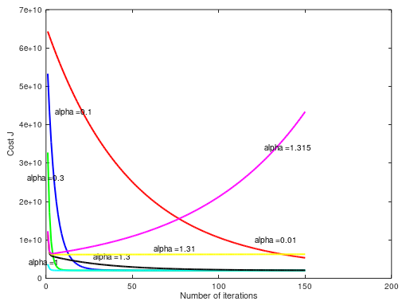
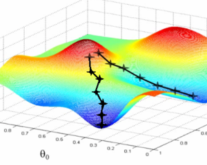

线性回归问题总结
===============

## 目录
+ 摘要
+ 线性回归概述
	- 假设函数与平方损失函数
	- 为什么是最小二乘法
	- 多项式回归
+ 梯度下降法
	- 一般描述
	- 学习率的选择
	- 在多变量下存在的问题
		+ 特征缩放
		+ 均值归一化
	- 局部最优
		+ 平方损失函数是凸函数
+ 规范方程法
	- 直觉理解
	- 严格数学推导
	- 不可逆
+ 过拟合
	- 过拟合概述与产生原因，解决方案
	- 正则化的损失函数
		+ 梯度下降法：仍然是凸函数
		+ 规范方程法：一定是可逆阵

## 摘要

这篇文章主要介绍线性回归问题。任何一种统计学习方法都由三个要素组成，即**模型**，**策略**以及**算法**；所谓模型，就是本文中的**假设函数**(`hypothesis function`)，策略或者评价准则，即本文中的**损失函数**，而算法，则是选取最优模型的方法。本文将从这三个方面对线性回归问题进行总结。

第一部分阐述了线性回归问题的基本概念，给出了它的假设函数以及损失函数的数学表达式，并且指出**平方损失函数**在本质上与**最大似然估计**无异。接下来的两个部分，分别阐述了求解该模型的两种算法，即**梯度下降法**与**规范方程法**，给出了两种方法的数学推导与数学表达式，并就实际应用中可能存在的问题进行讨论。最后，介绍了在统计学习中常见的一个问题——**过拟合**，并且就解决过拟合问题的常见方法——**正则化**(`regularization`)进行了深入的探讨。

这篇文章的重点在于：平方损失函数与最大似然估计的联系，平方损失函数是凸函数的证明，规范方程法的数学推导，正则化后的平方损失函数仍然是凸函数的证明以及正则化的规范方程一定可逆的证明。

## 线性回归概述

> 假设函数与平方损失函数。

线性回归问题是这样一个问题，对于输入$x$（$x$是一个$n$维向量，表示$n$个特征），假设输出$y$是$x$的线性函数。不妨设假设函数为

$$
\hat{y} = h_\theta(x) = \theta_0 + \theta_1x_1 + \cdots + \theta_nx_n
$$

为了简单起见，不妨引入一个$x_0 = 1$，这样

$$
\hat{y} = \Sigma_{i = 0}^n \theta_ix_i = \theta^Tx
$$

这里$\hat{y}$表示对$y$的估计值。因此，线性回归的任务，就是找到一个合适的列向量$\theta$，使得假设函数尽可能反映输入样本的特征。为了衡量假设函数与输入样本的符合程度，需要定义一个新的函数，这里称为损失函数或者代价函数(`cost function`)。

在线性回归问题中，常用的损失函数为平方损失函数(`square cost function`)，定义为$J(\theta)$

$$
J(\theta) = \frac{1}{2m}\Sigma_{i = 1}^m (\hat{y}^{(i)} - y^{(i)})^2 = \frac{1}{2m}\Sigma_{i = 1}^m (h_\theta(x^{(i)}) - y^{(i)})^2
$$

容易注意到，平方损失函数的主体是用最小二乘法给出的，它反映了样本预测值与实际值之间的偏离程度。假设函数越符合样本，则损失函数的值就会越小；反之，假设函数越偏离样本，损失函数的值就会越大。因此可以用损失函数的取值来定量衡量参数$\theta$的好坏，最优的一组$\theta$值，应该恰好使损失函数取到最小值。这样，就将参数优化问题，转化为了求解最值问题。

> 为什么使用平方损失函数？

使用平方损失函数并非偶然，而是由最大似然估计推导而出的。下面给出推导过程。

在线性回归问题中，模型假设实际上是输出$y$乃以$h_\theta(x)$为均值的**正态分布**，即

$$
y|x = h_\theta(x) + \epsilon,\ \epsilon \sim N(0, \sigma^2)
$$

所以有

$$
y|x \sim N(h_\theta(x), \sigma^2)\\
f(y | x) = \frac{1}{\sqrt{2\pi}\sigma}e^{-\frac{(y - \theta^Tx)^2}{2\sigma^2}}
$$

因此可以写出似然函数$L(\theta)$

$$
L(\theta) = \Pi_{i = 1}^m f(y^{(i)}|x^{(i)}) = (\frac{1}{\sqrt{2\pi}\sigma})^m\cdot e^{-\frac{1}{2\sigma^2}\Sigma_{i = 1}^m (y^{(i)} - \theta^Tx^{(i)})^2}\\

lnL(\theta) = -mln(\sqrt{2\pi}\sigma) - \frac{1}{2\sigma^2}\Sigma_{i = 1}^m(y^{(i)} - \theta^Tx^{(i)})^2
$$

这样，对似然函数求最大值，就等价于求

$$
\Sigma_{i = 1}^m(y^{(i)} - \theta^Tx^{(i)})^2
$$

的最小值，此时上面的平方损失函数也取到最小值。因此可以看到，平方损失函数实际上与最大似然估计是一脉相承的。

> 多项式回归。

实际上，线性回归还可以应用在非线性的场合，比方说有一个非线性的假设函数

$$
h_\theta(x) = \theta_0 + \theta_1x + \theta_2x^2
$$

不妨设$x_1 = x, x_2 = x^2$，这样就可以将上面的假设函数写作

$$
h_\theta(x_1, x_2) = \theta_0 + \theta_1x_1 + \theta_2x_2
$$

这样，就把非线性的假设函数转化为了线性回归问题，从而可以利用线性回归的方法来解决。该问题被称为**多项式回归**问题(`polynomial regression`)。

理论上来讲，一般的可导函数总是可以通过泰勒展开，写成多项式的形式，因此多项式回归理论上可以解决很多复杂的问题。然而，在实际应用中，当选择的多项式形式过于复杂时，可能会产生过拟合(`overfitting`)的问题，将会在后面阐述。

## 梯度下降法

> 梯度下降法的基本表述。

梯度下降法(`gradient descent`)是求解最优化问题的常见数值方法。它的基本思想是在每次迭代过程中，使得被优化的参数沿着函数下降速度最快的方向（即梯度的方向）移动一个微小的步长，随着迭代的进行，被优化函数的取值会越来越小，直至收敛至极小值点。

对于任意被优化函数$J(\theta)$，梯度下降法的参数更新公式为

$$
\theta_j := \theta_j - \alpha\frac{\partial}{\partial \theta_j}J(\theta)
$$

这里的$\alpha$称为**学习率**(`learning rate`)，它其实就是梯度下降法采用的步长。采用梯度下降法来求解平方损失函数的最小值，则有

$$
\theta_j := \theta_j - \frac{\alpha}{m}\Sigma_{i = 1}^m(h_\theta(x^{(i)}) - y^{(i)})x_j^{(i)}
$$

通过选择合适的迭代次数和学习率，就可以得到使$J(\theta)$最小的$\theta$了。

### 梯度下降法存在的问题若干

> 学习率$\alpha$的选择。

学习率的选择在梯度下降法中至关重要。如果学习率太小，则需要更多次迭代才能找到最优解，需要较长的学习时间；而如果学习率太大，也有可能导致收敛速度慢，甚至可能会发散。这是因为学习率太大时，不再满足全微分方程中微小变化量的条件，因此每次迭代后被优化函数都未必可以取到比上一次迭代更小的值。学习率的选择对$J(\theta)$收敛速度的影响如下图所示：

可以看到，当$\alpha$很小时（如图中红色曲线所示），损失函数$J(\theta)$收敛速度较慢。随着$\alpha$逐渐增大，曲线逐渐变得陡峭，收敛速度越来越快。可是当$\alpha$很大时（$\alpha = 1.3$，图中黑色曲线）收敛速度反而相对此前变慢了；$\alpha$继续增大将导致代价函数发散（图中洋红色曲线）。

因此，理想的方案是选择这样一个$\alpha$，它应该处于收敛与发散的临界点，一方面保证被优化函数最终收敛，另一方面还要有较快的收敛速度。

> 局部最优解。

从上面的讨论中可以看出，梯度下降法最终将收敛到某个局部最优点，而无法保证收敛到全局最优点。实际上，当选择不同的初始值时，使用梯度下降法往往会收敛到不同的极值点，如下图所示：

因此，使用梯度下降法无法保证得到的结果一定是全局最优解。然而，需要指出，对于线性回归与平方损失函数，则不存在这个问题，因为平方损失函数是**凸函数**。证明如下：

平方损失函数$J(\theta)$满足

$$
J(\theta) = \frac{1}{2m}\Sigma_{i = 1}^m (h_\theta(x^{(i)}) - y^{(i)})^2
$$

所以

$$
\frac{\partial}{\partial \theta_j}J(\theta) = \frac{1}{m}\Sigma_{i = 1}^m(h_\theta(x^{(i)}) - y^{(i)})x_j^{(i)}\\
\frac{\partial^2}{\partial \theta_j\partial \theta_k}J(\theta) = \frac{1}{m}\Sigma_{i = 1}^mx_j^{(i)}x_k^{(i)}
$$

因此，可以写出`Hessian`矩阵$H$:

$$
H = \frac{1}{m}\left[
	\begin{matrix}
		\Sigma_{i = 1}^mx_0^{(i)^2} & \Sigma_{i = 1}^mx_0^{(i)}x_1^{(i)} & \cdots & \Sigma_{i = 1}^mx_0^{(i)}x_n^{(i)}\\
		
		\Sigma_{i = 1}^mx_1^{(i)}x_0^{(i)} & \Sigma_{i = 1}^mx_1^{(i)^2} & \cdots & \Sigma_{i = 1}^mx_1^{(i)}x_n^{(i)}\\
		
		\vdots & \vdots &  & \vdots&\\
		
		\Sigma_{i = 1}^mx_n^{(i)}x_0^{(i)} & \Sigma_{i = 1}^mx_n^{(i)}x_1^{(i)} & \cdots & \Sigma_{i = 1}^mx_n^{(i)^2}\\
	\end{matrix}
\right]
$$

容易看出，

$$
H = X^TX
$$

因此$H$显然是一个**半正定矩阵**，根据凸函数判别的充分条件，可以得出平方损失函数为凸函数。

凸函数具有一系列的优良性质，比如说只有一个极值点，即全局最小值点。因此对凸函数使用梯度下降法总是可以收敛至全局最优点。

> 多特征的线性回归

在实际应用中，一个问题往往会有成百上千个特征，甚至更多。这些不同特征的有截然不同的取值范围，如果不同特征取值范围差别很大，则会导致梯度下降法收敛速度慢的问题。

考虑存在两个特征$x_1, x_2$，它们各自的取值范围分别是$0 < x_1 < 1$，$0 < x_2 < 1000$，两者相差了1000倍。在使用梯度下降法时，参数$\theta_2$的变化量也将大约是$\theta_1$的1000倍，这将导致损失函数等高线图呈现扁平的椭圆状，梯度下降路径相对取值范围更大的特征对应的参数来回波动，从而导致收敛速度缓慢。

为了解决上面的问题，需要对取值相差比较大的特征进行**特征缩放**(`feature scaling`)与**均值规范**(`mean normalization`)，具体的操作是求出每一个特征的均值$\mu$以及范围（最大值减去最小值），随后对每一个特征点进行以下更新

$$
x_j^{(i)} := \frac{x_j^{(i)} - \mu^{(i)}}{range^{(i)}}
$$

在实际应用中，也可以用**标准差**(`standard deviation`)来代替范围进行更新。这样更新后的特征取值范围都在$[-1, 1]$之间，绘出的等高线图接近于（高维）球形，收敛速度就要快多了。

## 规范方程

## 过拟合

> 规范方程法的推导

假设函数(hypothesis)$h_\theta(x)$满足

$$
h_\theta(x) = \theta^Tx = \theta_0x_0 + \theta_1x_1 + ... + \theta_nx_n = \Sigma_{i = 0}^{n}\theta_ix_i
$$

因此，平方损失函数(cost function)$J(\theta)$可以写作

$$
J(\theta) = \frac{1}{2m}\Sigma_{i = 1}^m[h_\theta(x^{(i)}) - y^{(i)}]^2
$$

参数$\theta$应该是使$J(\theta)$最小的一组列向量。由多元函数极值可知，$\theta$应该满足：

$$
\frac{\partial}{\partial \theta_j}J(\theta) = \frac{1}{m}\Sigma_{i = 1}^m[h_\theta(x^{(i)}) - y^{(i)}]x_j^{(i)} = 0
$$
解上述方程即可以得到$\theta$的解析解。

为了简单起见，下面用矩阵形式来对$J(\theta)$进行表述。矩阵$X, Y, \theta$可以分别表示为

$$
X = \left[
	\begin{matrix}
	x^{(1)^T}\\
	x^{(2)^T}\\
	\vdots\\
	x^{(m)^T}
	\end{matrix}
\right],\ \ 
Y = \left[
	\begin{matrix}
	y^{(1)}\\
	y^{(2)}\\
	\vdots\\
	y^{(m)}
	\end{matrix}
\right],\ \ 
\theta = \left[
	\begin{matrix}
	\theta_0\\
	\theta_1\\
	\vdots\\
	\theta_n
	\end{matrix}
\right]
$$
所以$J(\theta)$可以写作

$$
J(\theta) = \frac{1}{2m}(X\theta - Y)^T(X\theta - Y) = \frac{1}{2m}(\theta^TX^TX\theta - 2Y^TX\theta + Y^TY)
$$

对$\theta$求导，所以

$$
\frac{d}{d\theta}J(\theta) = \frac{1}{2m}(2X^TX\theta - 2X^TY) = 0
$$

从而可得

$$
\theta = (X^TX)^{-1}X^TY
$$

> 引入正则化项的规范方程推导

为了避免过拟合(overfitting)，在损失函数$J(\theta)$中添加正则化项(`regularization term`)，所以

$$
J(\theta) = \frac{1}{2m}[\Sigma_{i = 1}^m(h_\theta(x^{(i)}) - y^{(i)})^2 + \lambda\Sigma_{i = 1}^n\theta_i^2]
$$

同样可以利用多元函数极值，令

$$
\frac{\partial}{\partial \theta_j}J(\theta) = 0
$$

逐个求解出$\theta_j$，在此不再赘述。

为了简化问题，仍然用矩阵形式表示$J(\theta)$，所以

$$
\begin{aligned}
J(\theta) = &\frac{1}{2m}[(X\theta - Y)^T(X\theta - Y) + \lambda(I\theta)^TI\theta]\\
 = &\frac{1}{2m}(\theta^TX^TX\theta - 2Y^TX\theta + Y^TY + \lambda(I\theta)^TI\theta]
 \end{aligned}
$$
其中

$$
I = \left[
\begin{matrix}
0 & 0 & \cdots & 0\\
0 & 1 & \cdots & 0\\
\vdots & \vdots & & 0\\
0 & 0 & \cdots & 1
\end{matrix}
\right].
$$

所以

$$
\frac{\partial}{\partial \theta}J(\theta) = \frac{1}{2m}(2X^TX\theta - 2X^TY + 2\lambda I\theta) = 0
$$

从而可以解出

$$
\theta = (X^TX + \lambda I)^{-1}X^TY = (X^TX + \lambda \left[
\begin{matrix}
0 & 0 & \cdots & 0\\
0 & 1 & \cdots & 0\\
\vdots & \vdots & & 0\\
0 & 0 & \cdots & 1
\end{matrix}
\right])^{-1}X^TY
$$
需要说明的是，正则化项的引入不仅解决了过拟合的问题，还使得新的矩阵
$$
X^TX + \lambda I
$$

一定是可逆矩阵，而此前的

$$
X^TX
$$

则不能保证它的可逆性。下面给出证明。

前面已经指出

$$
X = \left[
	\begin{matrix}
	x^{(1)^T}\\
	x^{(2)^T}\\
	\vdots\\
	x^{(m)^T}
	\end{matrix}
\right] = \left[
\begin{matrix}
x_0^{(1)} & x_1^{(1)} & \cdots & x_n^{(1)}\\
x_0^{(2)} & x_1^{(2)} & \cdots & x_n^{(2)}\\
\vdots & \vdots & & \vdots\\
x_0^{(m)} & x_1^{(m)} & \cdots & x_n^{(m)}\\
\end{matrix}
\right]
$$

所以

$$
X^T = \left[
\begin{matrix}
x_0^{(1)} & x_0^{(2)} & \cdots & x_0^{(m)}\\
x_1^{(1)} & x_1^{(2)} & \cdots & x_1^{(m)}\\
\vdots & \vdots & & \vdots\\
x_n^{(1)} & x_n^{(2)} & \cdots & x_n^{(m)}\\
\end{matrix}
\right]
$$

容易注意到，$X^TX$的对角线元素一定大于或者等于零。且对角线上第一个元素为

$$
a_{11} = \Sigma_{i = 1}^mx_0^{(i)}\cdot x_0^{(i)} = m
$$

因此$X^T + \lambda I$的对角线元素$a_{ii}$一定大于$0$，对于任意的$\lambda > 0$成立。所以

$$
\left| X^T + \lambda I \right| = \Pi_{i = 1}^{n + 1}a_{ii} > 0
$$

因此$X^T + \lambda I$一定是一个可逆矩阵。实际上，还可以得到更进一步的结论，即$X^T + \lambda I$一定是一个正定矩阵。这是因为$X^TX$和$I$都是半正定矩阵，即对于任意的非零向量$\eta$，都有

$$
\eta^TX^TX\eta \ge 0,\ \eta^TI\eta \ge 0
$$

因此两者之和也必定是一个半正定矩阵。由于此前已经得到$X^T + \lambda I$可逆，故不存在为零的特征值，所以所有特征值都必定大于零，因此$X^T + \lambda I$是一个正定矩阵。
