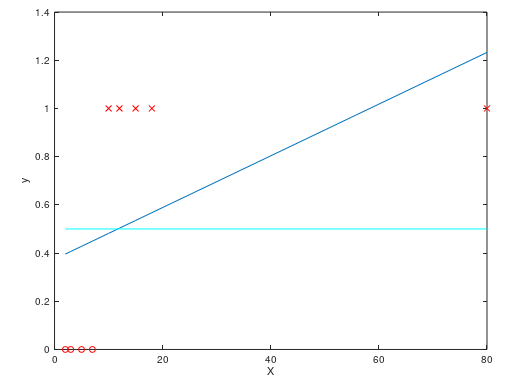

逻辑回归问题总结
==============

## 目录
+ 摘要
+ 逻辑回归概述
	- 逻辑回归的假设函数
		+ 假设函数的意义
		+ 决策边界
	- 损失函数
		- 为什么不使用平方损失函数
		- 对数损失函数
		- 最大似然估计
	- 多分类问题
+ 梯度下降法
	- 对数损失函数是凸函数
+ 过拟合
	- 正则化的损失函数

## 逻辑回归概述

在 [线性回归总结](../linear\ regression/linear\ regression.md) 中，简单介绍了线性回归问题，这里将要阐述的逻辑回归，却并不是回归问题，而是一个分类问题(`classification problem`)。分类问题与回归问题的主要界限，在于分类问题的输出是离散值，而回归问题的输出是连续的。根据分类问题输出取值数量的不同，又可以分为**二分类问题**和**多分类问题**，这里主要阐述二分类问题。

二分类问题的输出一般为0或者1，表示某一特定的事件不发生或者发生，比如辅助诊断系统判断患者患病或者不患病，邮件分类系统判断邮件是否是垃圾邮件，都是典型的二分类问题。

为了训练二分类问题，一种直觉上的方法是直接套用此前的线性回归模型，这样就可以得到模型的假设函数为

$$
h_\theta(x) = \theta^Tx
$$

仍然使用此前的平方损失函数以及梯度下降法（或者规范方程法）来对模型进行求解，对于某个简单的数据集，可以得到下面的结果

此时$h_\theta(x)$的输出值仍然是连续值，而二分类问题要求模型的输出是0或者1，因此需要对假设函数的输出进行进一步处理。这里可以简单地令$\hat{y} = 1$当且仅当$h_\theta(x) >= 0/5$，令$\hat{y} = 0$当且仅当$h_\theta(x) < 0.5$。可以看到，采用这种策略时，对上图的数据具有很高的预测正确率。

然而这种方法却也有局限性，考虑在训练集中增加一个样本点$X = 80, y = 1$，此时线性回归模型的结果如下图所示：

可以看到，此时回归直线相对此前向右偏移，模型对训练集的预测能力下降了不少。可以想象，如果训练集中还有更多这样的极端数据，回归的直线将继续向右偏移，模型的预测能力将继续下降。

此外，线性回归模型的假设函数，其输出应该是表示$Y = 1$的概率，然而其值域是$(-\infty, +\infty)$，当$h_\theta(x) > 1$或者$h_\theta(x) < 0$时不具有意义。可见，简单套用线性回归的方法来解决分类问题是行不通的。

### 逻辑回归的假设函数

可以做一些简单的修改，使得假设函数的值域限制在$[0, 1]$。这里引入**sigmoid函数**，它的表达式$g(z)$满足

$$
g(z) = \frac{1}{1 + e^{-z}}
$$

可以看出，它的取值范围恰好在$(0, 1)$之间，实际上，它的图像如下所示：

因此，可以把 sigmoid 函数作用到此前的线性回归模型上，就得到了新的假设函数

$$
h_\theta(x) = sigmoid(\theta^Tx)
$$

此时，它的函数值，就可以被理解成在输入为$x$的条件下，$y = 1$的概率，即

$$
P(y = 1| x) = sigmoid(\thetax)
$$

> 决策边界

以下对 sigmoid 函数进行进一步的讨论。前面已经指出，假设函数的返回值，表示的是预测样本为正(`positive`)的概率。一般地，当$h_\theta(x) >= 0.5$时，预测$\hat{y} = 1$；当$h_\theta(y) < 0.5$时，预测$\hat{y} = 0$。这样，$h_\theta(x) = 0.5$就成为正负样本的边界，称为**决策边界**(`decision boundary`)。

由

$$
h_\theta(x) = sigmoid(\theta^Tx) = 0.5
$$

根据 sigmoid 函数的图像，恰好可以得到

$$
\theta^Tx = \theta_0x_0 + \theta_1x_1 + \theta_2x_2 + \cdots + theta_nx_n = 0
$$

容易看出，这是一个（高维）平面的方程，预测为正负的样本，分别分布在该平面的两侧。因此，逻辑回归的假设函数，本质上就是找到这样一个高维平面对样本点进行划分，达到尽可能高的划分正确率。

利用**多项式回归**，可以得到更加复杂的决策边界。比如令

$$
h_\theta(x) = sigmoid(\theta_0 + \theta_1x_1 + \theta_2x_2 + \theta_3x_1^2 + \theta_4x_2^2)
$$

则得到的决策边界为

$$
\theta_0 + \theta_1x_1 + \theta_2x_2 + \theta_3x_1^2 + \theta_4x_4^2 = 0
$$

容易看出，这是一个圆锥曲线。因此，通过构造更高阶的多项式，可以得到相当复杂的决策边界，从而可以将逻辑回归应用到更加复杂的分类问题当中。
