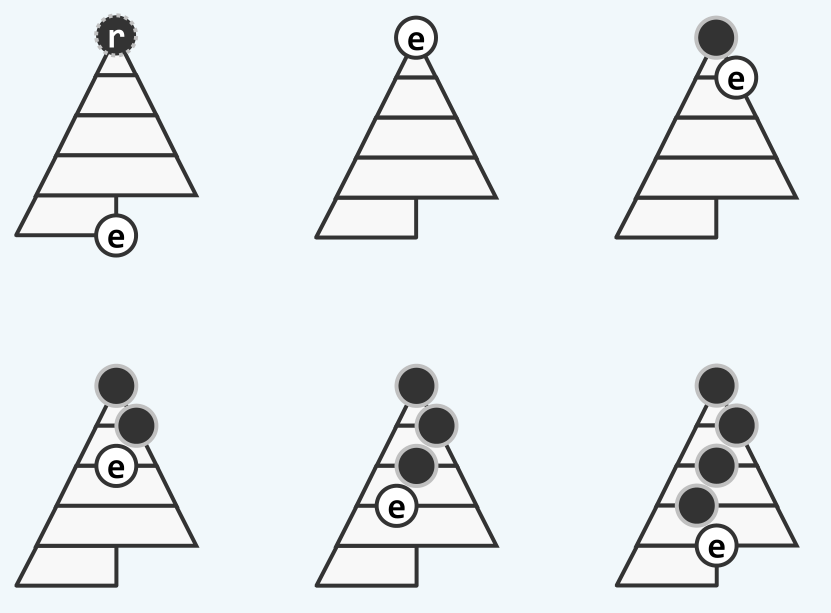

完全二叉堆知识总结
================

## 知识脉络

本章的主要内容是完全二叉堆和左式堆，它们都是用于[优先级搜索]这一特定的应用场景的，即每次只是找到其中的最值元素。完全二叉堆的关键在于`堆序性`和`结构性`——得益于`结构性`，完全二叉堆可以使用`向量`来存储，在相当地程度上简化了它的实现；左式堆主要用于`堆的合并`，该操作是通过递归地将堆A的右子堆与堆B合并，再将合并后的堆重新连接在堆A的右孩子上面来实现，其性能正比于两堆的最右侧通路长度之和。左式堆的关键在于`堆序性`和`左倾性`，即任意节点左孩子的`空节点路径长度`(npl, null path length)都不小于右孩子，基于此左式堆的最右侧路径即是全局最短路径，从而保证了`堆的合并`高效地进行。由于需要频繁地提取和接入堆的右子堆，左式堆显然不能基于`向量`实现，而是需要使用`二叉树`作为底层结构。

堆在前面讨论过的算法中有不少应用，比如第六章的`优先级搜索`(PFS, Priority First Search)中，每一步迭代都需要找到所有节点中优先级最高的节点，使用一个堆结构可以将该算法的时间复杂度提升至`O((n + e)logn)`，需要指出的是这里的堆结构还应该支持节点的优先级修改（提升）操作，这可以简单地通过`上滤`(percolate up)来实现。可以注意到，在稠密图的情况下，引入了堆结构以后该算法的性能反而下降了，为了解决这个问题，可以引入一个`多叉堆`(d-heap)，其`上滤`和`下滤`操作的时间复杂度分别为`O(log_d^n)`以及`O(dlog_d^n)`，如果令`d = e/n + 2`，此时的整体时间性能为`O(ndlog_d^n + elog_d^n)`，则无论在稀疏图还是稠密图，都可以自适应得到最优的性能。

优先级队列在外部排序中也有相应的应用。例如在归并排序中，为了减少I/O的访问次数，往往采用`多路归并`的方法，此时每一次归并都需要从`m`路的数据中选择出最值。在实际应用中，往往是使用`锦标赛树`来实现，顾名思义，`锦标赛树`是采用类似于锦标赛的模式，对数据进行两两比较，层层筛选最终得到全局的最值（即冠军）。在这种应用场合下，锦标赛树的性能是优于堆的，尽管只是在常系数的层面上，这是因为堆的`下滤`每次需要两次比较，而锦标赛树的每一步`重赛`(replay)只需要一次，同理在[从n个元素中选取最小的k个](k << n)问题中，锦标赛树也具有更优的性能。

锦标赛树还具有一些问题，例如每次`重赛`都需要沿着路径迂回访问邻居节点，为了避免这些不必要的迂回，可以把每次比较的[败者]记录在父亲节点当中，这样每次`重赛`就只需要和父亲节点进行比较，这就是`败者树`，在`多路归并选择排序`当中，实际上用的就是`败者树`。

`线段树`(segment tree)并不是这里的内容，但是昨晚也学习了一下，简单做一个总结。`线段树`主要是用于一维区间的统计问题，感觉很类似`kd树`，应该是`kd树`的退化情况。它的基本思想是将一个区间做平均划分，划分的两个子区间分别作为当前节点的左右子树，再将上述过程递归地进行，直至每个区间都是单位区间大小。线段树要解决的问题需要满足`可加性`，即问题的解可以通过若干个子区间加和而得到，比如说每个区间都有一个权重，给定一个查询区间，求其中的权重之和——平凡的方法是针对每一个单位区间分别统计求和，时间复杂度为`O(r)`，`r`为查询区间包含的单位区间个数，但是对于区间权重相对固定，查询区间动态变化的场合（即`在线`问题），该算法的时间性能未免太差。而通过`线段树`，则可以不用访问每个单位区间，而是直接查询作为内部节点的某一些较大区间，即可完成统计。

`线段树`主要有三种操作，一是`建树`，然后是`区间修改`和`区间查询`。可以简明地使用向量来作为底层存储结构，尽管它本身并非是一棵完全二叉树。设区间长度为`n`，则线段树至多需要`4n`的存储空间，这是因为`线段树`的平衡性很好，其左右子树至多相差两个节点，因此若`线段树`的高度为`h`，则它的高度为`h - 1`的子树一定是满二叉树。这样，对于一个叶节点数量为`n`的线段树，总结点数量为`2n - 1`，因此`4n`的空间足以容纳高度为`h`的满二叉树的全部节点。实际上，`2n - 1`向上取整到最近的`2^k`的空间就足够了。

为了建立`线段树`，可以采用递归的策略，自上而下地对区间进行二分，直至区间成为单位区间；`线段树`的`区间修改`采用`懒惰修改`的策略，即并不对所有叶节点进行修改，而是将要修改的量保存在它们的祖先结点当中，称为`lazy_tag`，由于对这些祖先结点的值进行了修改，因此不会影响到查询的正确性。`区间查询`沿用二叉树的区间查询的方法，即自顶向下不断判断区间的关系，从而定位要查询的区间，如果在向下深入的过程中，发现了`lazy_tag`，则需要将之向下传递，并且修改路径上区间的权重。

## 优先级队列

在很多具体的应用条件下，我们都只关心一组数据中的最大值或者最小值，比如考完试大家首先都是看谁是第一名，谁又是最后一名；比如我只知道世界最高峰是珠穆朗玛峰，却不知道后面的第二第三都是什么；比如在操作系统中的诸多算法，都是基于优先级来进行的，像是页面置换算法还有进程调度算法，这个时候总是选出其中优先级最高的页面将它换出，或者优先级最高的进程，让它占用CPU。

支持上面这种操作，即每次只是获得其中取到最值的元素，的抽象数据类型，就是我们这里要讲的优先级队列(`Priority Queue`)。除了获得其中的最值元素外，优先级队列显然还应该支持元素的动态插入与删除，以及判空操作与获得元素的个数。据此，可以给出优先级队列的抽象类：

```cpp
template <typename K, typename V>
class PriorityQueue{
public:
	virtual int  size() = 0;
	virtual bool empty() = 0;
	virtual V*   getMax() = 0;
	virtual void insert(K key, V value) = 0;
	virtual void delMax() = 0;
}
```

> 优先级队列的实现

可以有很多方法来实现上面定义的优先级队列ADT。例如我可以直接用一个最简单的向量`Vector`作为优先级队列的底层结构。调用`getMax`时，就对向量中的所有元素一一遍历，并返回其中的最大值。同理，调用`delMax`时，首先调用`getMax`找到这个最大元素，并且将它从向量中移除。很明显，这两个操作的时间复杂度都是`O(n)`。

我们不难找到一种更加高效的底层结构，比如在前面说过的多种平衡二叉搜索树，比如AVL树或者红黑树。根据前面的知识，无论是插入元素还是删除最大值元素，都只需要`O(logn)`的时间；而为了实现`getMax`操作，只需沿二叉树的最右侧路径不断深入，直到最后一个结点，它的时间复杂度正比与二叉树的高度，即也是`O(logn)`。

利用平衡搜索树的确可以做到非常高效地实现优先级队列。让我们进一步考察平衡搜索树，在平衡搜索树中，本质上维护了所有元素的一个全序关系，实际上，搜索树的中序遍历正是对应了所有元素的一个有序序列。但是应该注意到，优先级队列并不需要一个这么强的条件，它只是要求每次访问到最大元素就可以了，并不关心最大元素外的其他元素是否是按序排列的。因此，`BBST`的功能实际上远远超出了优先级队列的要求，而为了维护这些额外的信息也是需要成本的。

因此，或许有更为简单的底层结构，它的维护更为简单，因此上面几个基本操作的成本也要更优于`BBST`，至少在常系数的意义下。而这就是我们要详细叙述的平衡二叉堆和左式堆，其中左式堆在[这篇文章](leftistHeap.md)中做了说明。

## 完全二叉堆的基本概念

完全二叉堆的基本概念有两个关键点，即`结构性`与`堆序性`。

`结构性`不言而喻，完全二叉堆在结构上是一棵完全二叉树。如下图所示：


这意味着，可以简明地利用向量`Vector`来作为它的底层结构，因为此时父子结点之间的链接关系，可以直接通过它们的秩`Rank`来体现，而不需要像一般的树结构那样显式地给出链接。具体说来，假设根节点从`0`开始编号，则对于任意秩为`i`的节点，它的父节点的秩一定为`(i - 1) / 2`，它的左孩子的秩一定为`2i + 1`，右孩子的秩一定为`2i + 2`（如果左右孩子存在的话）。因此，可以给出下面的宏定义：

```cpp
#define PARENT(i)     ((i - 1) >> 1)
#define LEFTCHILD(i)  ((i << 1) + 1)
#define RIGHTCHILD(i) ((i << 1) + 2)
```

而`堆序性`则是指完全二叉堆维护的内部元素的偏序关系，具体说来就是任意节点的值（或者优先级）不小于它的两个孩子节点。即

```cpp
CBHeap[i] >= MAX(CBHEAP[LEFTCHILD(i)], CBHEAP[RIGHTCHILD[i]]);
```

很明显，`堆序性`是相比于二叉搜索树的有序性弱得多的条件。在`堆序性`的前提下，只能保证沿任意一条路径，元素的值是自上而下递减的，而在完全二叉堆的左右子树之间，没有任何的大小关系。但是通过`堆序性`我们可以得到，完全二叉堆的堆顶`CBHEAP[0]`是全局的最大元素，这样，只要直接取出堆顶，就可以实现了`getMax`函数：

```cpp
template <typename K, typename V>
V* CBHeap<K, V>::getMax(){
	if(empty()) return nullptr;
	return _elem[0];
}
```

下面重点阐述如何基于完全二叉堆实现优先级队列ADT，即实现其中的`insert`和`delMax`函数。实际上，任何数据结构的实现，都必然在于两个方面，即首先利用它的某些内部性质完成相应的功能，比如插入与删除，然后通过有限的调整保证操作之后这些性质仍然是满足的。前面的AVL树是如此，伸展树是如此，B树和红黑树都是如此，这里的完全二叉堆也是如此。

## 完全二叉堆的实现

### 插入接口的实现

由于完全二叉堆的底层是采用向量`Vector`来实现的，为了将一个新的元素插入到向量中，最简明最高效的策略是直接将这个元素放到向量的末尾，这个操作只需要`O(1)`的时间。但是这样操作以后，堆的`堆序性`很可能遭到破坏，因此下面主要讨论如何恢复`堆序性`。

应该注意到，将一个元素插入到向量的末尾后，只有可能在新插入的元素及它的父亲节点之间不满足`堆序性`，而不会影响到所有其他元素，这是因为前面讲到的，堆的左右子树之间不存在任何的次序关系。

如果新插入的元素和它的父节点之间的确不满足`堆序性`，即新插入的元素大于它的父亲节点，为了恢复`堆序性`，只需要将这两个元素交换即可。这样一次操作之后，虽然原有的堆序性得到满足，但是新插入的元素又有可能与它的新的父亲节点之间不满足`堆序性`。为此，我们只需要不断地重复交换操作，直到这种冲突不再发生。插入的过程如下图所示：


可以看到，在这种插入策略下，新插入的节点是由下而上不断攀升的，因此这种插入又被称为`上滤插入`。为了实现`上滤插入`，可以首先将`上滤`操作进行抽象，形成一个内部函数，在`insert`中调用该函数即可。具体的代码如下：

```cpp
template <typename K, typename V>
void CBHeap<K, V>::percolate_up(int pos){
	entry<K, V> tmp = get(pos);
	while(HASPARENT(pos)){
		if(get(PARENT(pos)) >= tmp) break;

		get(pos) = get(PARENT(pos));
		pos = PARENT(pos);
	}
	get(pos) = tmp;
}

template <typename K, typename V>
void CBHeap<K, V>::insert(entry<K, V> e){
	push_back(e);
	percolate_up(getSize() - 1);
}
```

容易证明，这种插入策略是正确的，因为每次交换都可以解决原有的`堆序性`冲突。虽然这种冲突可能在插入结点与新的父亲节点之间再次出现，但是此时插入结点的高度已经提升了一个单位，并且至多提升到树根，因此至多进行`h`次交换操作，这里的`h`为完全二叉树的高度。

在这里，已经可以看出完全二叉堆相对于`BBST`的优势了——对于`BBST`而言，虽然插入操作也只需要`O(logn)`的时间，但是正如我们前面也提到过的，平衡二叉树的平衡并非一种绝对平衡，而是相对的平衡，它的树高只是在渐进意义上可以达到`O(logn)`，却往往具有一个比较大的常系数。而对于完全二叉堆而言，它的树高就是严格的`logn`，因此在常系数的意义下是优于`BBST`的。

### 删除接口的实现

为了删除堆中的最大元素，只需要将向量的首元素摘除就可以了，但是接下来的问题是，如何在摘除首元素后保证`堆序性`，即找到一个新的最大元素作为首元素。

首先，为了摘除首元素，是不可能调用向量的`pop_front`接口的，因为这将涉及到剩下`n - 1`个元素的整体移动，时间复杂度为`O(n)`。为此，只需要仿照插入时的策略，将向量中的最后一个元素`last_elem`填补到首元素，这样就保证了堆的`结构性`，以及除了新的树根与它的两个孩子节点以外的`堆序性`。

为了修复树根处的`堆序性`，可以将`last_elem`与它的两个孩子节点进行比较，并且将其中的最大者（堪为父者）作为新的树根，此时树根处的`堆序性`将得到修复。但是和插入节点的情形一样，此时`堆序性`冲突有可能传递到`last_elem`的新位置处，此时只需要简明地重复上面的操作，直到这种`堆序性`冲突不再发生。删除最大元素的过程如下图：



可以看到，为了调整堆的`堆序性`，被放置到树根的末元素是由上至下不断下降的，因此这种删除策略也被称为`下滤删除`。我们同样可以将下滤操作进行抽象，然后在`delMax`函数中调用下滤操作来实现`delMax`函数。具体的代码如下：

```cpp
template <typename K, typename V>
int CBHeap<K, V>::proper_parent(int pos){
	if (!HASLCHILD(pos)) return pos;
	if (!HASRCHILD(pos)) return get(pos) >= get(LCHILD(pos)) ? pos : LCHILD(pos);
	int proper = get(pos) >= get(LCHILD(pos)) ? pos : LCHILD(pos);
	return get(proper) >= get(RCHILD(pos)) ? proper : RCHILD(pos);
}

template <typename K, typename V>
void CBHeap<K, V>::percolate_down(int pos){
	entry<K, V> tmp = get(pos);
	for(int p = proper_parent(pos); p != pos; p = proper_parent(pos)){
		get(pos) = get(p);
		pos = p;
		get(pos) = tmp;
	}
}

template <typename K, typename V>
entry<K, V> CBHeap<K, V>::delMax(){
	entry<K, V> max = get(0);
	_elem[0] = _elem[_size-- - 1];
	percolate_down(0);
	return max;
}
```

和`上滤插入`一样，容易证明`下滤删除`策略的正确性，因为这种下滤至多只会进行`h`次，`h`是完全二叉树的树高。因此，删除最大结点的时间复杂度仍然是`O(logn)`。

## 批量建堆

很多具体的应用场景中，初始的输入都是成批给出的，此时需要考虑的一个问题是，如何高效地将这些初始的数据组织成一个完全二叉堆，也就是这里的批量建堆问题。

### 蛮力算法

实际上，这个问题可以借助上面已经实现的`insert`接口快速地解决。为了将n个初始给定的元素组织成一个完全二叉堆，只需要对这n个元素依次调用`insert`函数即可，于是形成了下面的代码：

```cpp
template <typename K, typename V>
void CBHeap<K, V>::heapify(entry<K, V>* elems, int n){
	for(int idx = 0; idx != n; ++idx)
		insert(elems[idx]);
}
```

这种实现方法虽然简单，性能却比较糟糕。根据上面的分析，每次调用`insert`函数的时间复杂度为`O(logn)`，这样，将`n`个元素组织成一个完全二叉堆需要的时间成本为`O(nlogn)`，而在相同的时间内，已经可以对这`n`个元素做一个全排序了，我们这里却只得到了一个偏序关系，可见，这里的批量建堆算法是还有提升的余地的。

进一步考察这里的蛮力算法，可以看到，将所有的输入元素都组织成一个向量之后，第一次将一个元素插入到空堆当中，即形成了一个规模为1的堆；接下来插入第二个元素，等价于对向量中的第二个元素进行一次上滤操作`percolate_up`，于是形成了一个规模为2的堆；以下同理，再对接下来的元素进行上滤，形成一个规模为3的堆。

因此，这里的蛮力算法，其实是等价于将向量中的每一个元素，依次调用一次上滤操作`percolate_up`，就可以使之成为一个完全二叉堆。每个元素上滤的成本正比于它的深度，设最终完全二叉堆的高度为`h`，所以蛮力算法的时间复杂度为

$$
2\times 1 + 2^2\times 2 + \cdots + 2^k\times k + \cdots + 2^h \times h = (h - 1)\times 2^{h + 1} + 2 = O(nlogn)
$$

与上面分析的结论一致。

### `Floyd`算法

首先来考虑一个问题，对于两个给定的堆，和任意一个独立的节点，如何将它们组织成一个更大的堆。

实际上，这个问题已经在前面有过讨论了——在删除最大节点的算法中，不正是将向量末尾的节点作为新的树根，然后将该节点与左右子树两个堆进行合并吗？因此，只需要将两个给定的堆分别作为独立节点的左子树与右子树，然后对独立节点调用一次下滤操作`percolate_down`就可以了。

我们可以将上面的讨论推广到批量建堆的算法当中。首先需要明确，单个节点本身也形成一个完全二叉堆，满足`结构性`与`堆序性`。为了将所有的输入元素组织成一个完全二叉堆，首先仍然将它们组织成在一个向量当中，并且将它视作一棵完全二叉树，在初始状况下，只有树的所有叶节点各自构成一个规模为1的完全二叉堆。为了将这些完全二叉堆合并成一个更大的完全二叉堆，首先对于完全二叉树中的最后一个内部节点调用上面的合并算法，此时该节点连通它的孩子节点将构成一个更大的堆，此后只需要自后向前不断重复上述过程，就可以将各个子堆逐层合并，最终`堆序性`将在全局得到恢复。这就是`Floyd`建堆算法，它的代码如下：

```cpp
#define LASTINTERNAL(n) PARENT(n - 1)

template <typename K, typename V>
void CBHeap<K, V> heapify(entry<K, V>* elems, int n){
	copyfrom(elems, 0, n);
	for(int idx = LASTINTERNAL(n); idx >= 0; --idx)
		percolate_down(idx);
}
```

对`Floyd`算法进行分析，每一个内部节点，都将调用一次`percolate_down`函数，它的成本正比于每个节点的高度，因此整体的时间复杂度应该取决于所有内部节点的高度总和。假设完全二叉树的高度为`h`，则`Floyd`算法的时间复杂度为：

$$
h \times 1 + (h - 1)\times 2 + \cdots + (h - k)\times 2^{k} + \cdots + 1 \times 2^{h-1} = 2^{h + 1} - h - 2 = n - log(n) = O(n)
$$

可以看到，`Floyd`算法和蛮力算法相比，蛮力算法是每个节点都调用一次上滤操作`percolate_up`，而`Floyd`算法是每个节点调用一次下滤操作`percolate_down`，而这就导致了它们性能上的巨大差别。具体说来，上滤操作的时间复杂度正比于节点的深度，而下滤操作的时间复杂度正比于节点的高度，对于完全二叉堆中的所有节点，大部分都是处于底层的节点，它们的高度较小而深度较大，因此`Floyd`算法就是让多数节点的操作较快，而蛮力算法则是使多数节点的操作更慢，这就是它们性能上差别的本质原因。实际上，`Floyd`算法就类似于`Huffman`树的思想——使处于底层的多数节点具有更小的权重，或者更快的操作。

## 堆排序

堆的一个具体的应用就是堆排序算法。它的本质其实就是选择排序`SelectSort`，只是在选择当前最大元素的过程中，调用了堆的`getMax`函数，使得一次选择的时间消耗减少了。因为太简单，这里就不多叙述了。
