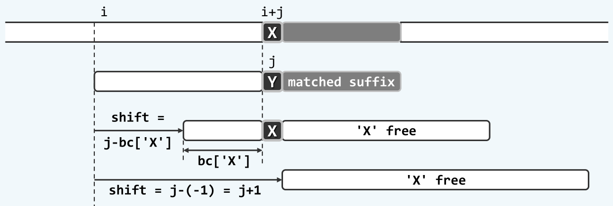

串匹配之bm算法
=============

## 以终为始

在[串匹配之kmp算法](kmp.md)中，已经简单介绍了`kmp`算法的基本原理与实现。`kmp`算法的基本思想，是利用已经成功匹配的字符的信息，快速跳过无意义的对齐位置，从而实现更高的效率。下面，我们首先对这样的思想进行更深入的研究。

在实际的串匹配问题中，字符集的规模往往是挺大的，比如说英文字符集，就至少有52个字符，更不要提ASCII码，还有中文字符集了。这样，在随机的情况下，一次比对成功的概率只有`1/52`，并且多次比对成功的概率以指数的速率减小，比对的次数服从几何分布，期望的比对次数仅有一次。在这种情况下，即使是蛮力算法，其时间复杂度也只有`O(n + m)`。

在一般的串匹配问题中，模式串的规模较小而文本串的规模往往极大，比如在一篇论文中查找某个英文单词的情形，在这种情况下，文本串中往往具有大量模式串中不会出现的字符。设想如果在任意一个对齐位置，模式串与文本串是从后往前比对，此时一旦在文本串中出现模式串中不存在的字符，就可以将整个模式串移出这个字符，从而跳过大量无意义的对齐位置。如下图所示：


如我们前面指出的那样，这种情况在头几次比对中出现的概率是极高的，因此相对于自左向右的比对，将比对的方向变成自右向左，的确可以极大地提高串匹配的效率。

## bm-bc策略

坏字符(bad character, bc)策略是一种非常简明的策略。它的基本思想是，在自后向前的某次匹配中，一旦在某个位置`k`比对失败，则将模式串整体右移，并且重新从右至左开始新一轮的比对，将比对失败的字符称为坏字符。而要使下一个对齐位置能够匹配，则至少要在坏字符处能够匹配才行，如下图所示：


因此，坏字符策略实现的关键，就在于找到模式串中，位于坏字符`Y`左侧，并且与字符`X`能够匹配的下一个字符。应该指出的是，这样的字符能够有多个，也就对应了多个移动距离，所有这些移动距离都是值得对齐的。因此，为了不错过其中的任意一个字符，应该取移动距离最小的那一个，使之与文本串中的`X`对齐。

为了快速地确定下一个对齐位置，可以仿照`kmp`算法的思路，对于模式串中出现过的所有字符，保存每个字符出现的最后位置，构成`bc`表，以便在字符匹配时迅速更新对齐位置。因此，`bc`表就有$\left|\Sigma\right| + 1$项，其中$\Sigma$为模式串的字符集大小，并且将额外的一项用来代表所有没有在模式串中出现过的字符，此时直接将模式串整体移过该字符。

这样，`bm-bc`策略就可以利用`bc`数组来快捷地实现了。在一次匹配失败后，比如失败位置`j`处文本串字符为`X`，查询`bc`表会有三种情况：

一是`bc[X]`的确存在，并且`bc[X] < j`，此时直接将`bc[X]`处的字符平移到与文本串中的`X`对齐，即可开始新一轮的比对，此时模式串移动的距离应该是`j - bc[X]`；另一种情况是`X`没有出现在模式串的字符集中，此时应该将模式串整体移动字符过`X`，即移动的距离的`j + 1`，为了与上面的情况统一，可以令`bc[*] = -1`，其中`*`表示所有没有出现在模式串中的字符，另一种理解方法是认为在模式串的左侧`P[-1]`存在一个通配符可以与`X`匹配。这两种情况如下图所示：



最后一种情况是`bc[X]`存在，但是`bc[X] > j`，即`P[bc[X]]`出现在`P[j]`的右侧，此时显然是不可以将`P[bc[X]]`与文本串中的`X`对齐的，因为此时将造成模式串的左移。实际上，这种对齐早在之前的比对中就已经被排除掉了。这种情况下，不妨简单地让模式串右移一个单位，然后从右至左开始新一轮的比对。该情况如下图所示：


这样，可以形成下面基于`bm-bc`策略的串匹配代码：

```c
int match(char* text, char* pattern){
	int *bc;
	makeBC(text, &bc);
	......
}
```

### `bc`表的构建

实际上，在前面的讨论中，已经涉及到了如何构造`bc`表的问题，这里做一个统一的总结。为了构造`bc`表，需要遍历模式串中的每一个字符，并且把每个字符`X`最后出现的位置保存在`bc[X]`中。为了简单起见，这里的`bc`表包含全部字符集，比如整个ASCII码字符集，这样便于判断某个字符是否出现在模式串当中，否则还需要额外建立一个散列表或者位图，还是需要消耗同样的空间，因此这里的`bc`表兼具了给出移动位置以及散列表的作用。

在`bc`表的构建中采用`画家算法`(painter's algorithm)，即从左至右遍历模式串，对于其中每一个出现的字符，都将其位置（或者秩）更新到其在`bc`表中对应的项中，这样，遍历结束时`bc`表保存的就是所有字符最后出现过的位置了，因为`bc`表中各项的值，只取决于该字符最后一次出现的位置，类似于画家作画时，画布上的某处最终的颜色，仅取决于画家在该处的最后一笔，因此称之为画家算法。`bc`构造的算法如下：

```c
void makeBC(char* const pattern, int* bc){
	bc = new int[256];
	for(int ix = 0; ix != 256; ++ix)
		bc[ix] = -1;                             //initialize to -1
	for(int ix = 0; pattern[ix] != '\0'; ++ix)
		bc[pattern[ix]] = ix;                    //painter's algorithm
}
```

使用`bc`策略时，最好可以达到`O(n/m)`的时间复杂度，对应了每次都在最右一个字符匹配失败，然后整体右移`m`个单位的情况，如下图所示：


这固然是一个非常好的结论，但是`bc`策略在最坏情况下却会达到`O(mn)`的时间复杂度，与蛮力策略相当，该情况如下图所示：


可以看到，在这种情况下，每次都需要进行`m - 1`次比对，才能在最左侧一次比对中失败，而该次失败只能让模式串右移一个单位。这种情况正与蛮力策略的最好情况相一致。一般地，单次匹配成功的概率越大，即字符集越小，就越接近于这种最坏的情况；单次匹配成功的概率越小，即字符集越大，就越接近于最好的情况。
