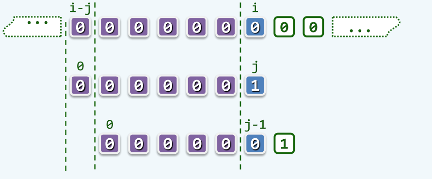

kmp conclusion
==============

字符串匹配问题是算法中的常见问题，即对于一个较长的文本串`T`，以及一个较短的模式串`P`，返回模式串`P`在文本串`T`中是否出现，或者首先出现的位置，或者所有出现的位置。实际上，在实际生活中，具有大量的字符匹配问题的应用场景，例如一般的编辑器软件，都具有的查找替换功能，还有像是`google`这种软件，本质上就是从整个因特网的文本数据中，去查找用户搜索的字符串。

以下主要讨论如何实现串匹配问题。

## 一种简明的策略

为了查找模式串`P`在文本串`T`中出现的位置，最简单的思路就是对于每一个可能的对齐位置，依次去比对两个串中的字符是否相等，如果完全匹配，则返回匹配成功；否则就在下一个对其位置开始新的匹配。该策略执行的流程如下图所示：


容易看出，这种策略在最坏情况下，在每个对齐位置都需要进行`m`次比对，其中`m`为模式串的长度，设文本串的长度为`n`，则最坏情况下的时间复杂度为`O(mn)`。一种最坏情况的实例如下图所示：


## kmp

对上面的蛮力策略进行分析，可以发现其时间性能较差是因为在该策略中做了大量无意义的比对。比如上图中的这种情况，在每一个对齐位置都首先进行`m - 1`次成功的比对，其中每个字符都是`'0'`，然后失败于最后的一次比对。每次移动到新的对齐位置后，此前比对过的字符，将再次参与比对。如下图所示：



正是这些重复的比对，拉低了该策略的时间性能。因此，就应该从避免这些重复工作的角度，来对该算法进行改进。

具体的做法是，如果在一次比对中，失败于模式串`P`中第`k`各字符，则此前已经进行了`k - 1`次成功的比对，因此此时我们已经获悉了文本串`T`中对之对齐的`k - 1`个字符的全部信息，因此就可以将模式串快速移动，直到移动到下一个“值得”对齐的位置。这里的“值得”对齐的位置，其实就是移动后模式串的前缀，要与文本串中这`k - 1`个字符的后缀相匹配。这就是`kmp`算法的基本思路。

应该注意到，采用`kmp`策略时，每次移动的距离只与模式串`P`有关，而与文本串`T`无关。这是因为在第`k`个位置失配后，文本串中的这`k - 1`个字符和模式串长度为`k - 1`的前缀完全相同。因此所谓“值得”对齐的位置，其实就是这`k - 1`字符构成的串，前缀和后缀自相匹配的位置。

需要指出的是，这样的位置可能有多个，所有的这些位置都是“值得”的对齐位置，因此，为了不错过其中的任意一个对齐位置，移动距离应该取所有这些自匹配位置中最小的，也就是自匹配长度最长的。为了在`kmp`算法运行过程中，迅速更新串的对齐位置，可以对模式串`P`做预处理，将在第`k`个字符处匹配失败的最长自匹配长度，保存在`next[k]`中，以便于查询。这样，就可以实现`kmp`算法了：

```cpp
int match(char* text, char* pattern){
	int* next = makeNext(pattern);
	int i = 0, j = 0, m = strlen(text), n = strlen(pattern);
	while(i < m && j < n){
		if(j < 0 || text[i] == pattern[j]){
			++i;
			++j;
		}
		else j = next[j];
	}
	return i - j;
}
```

可以看到，如果匹配成功，则同时移动文本串和模式串的指针；一旦匹配失败，就将模式串的指针移动到`next[j]`，即实现上面所说的快速移动。需要注意的是对`j < 0`情况的处理，此时相当于在模式串的左边具有一通配符，即`pattern[-1] = *;`，它可以匹配任何的字符，这样就可以将该情况与匹配成功做相同的处理。

这样，现在的主要问题就是如何构造这样一个`next`数组，即实现上面的`makeNext`函数。
