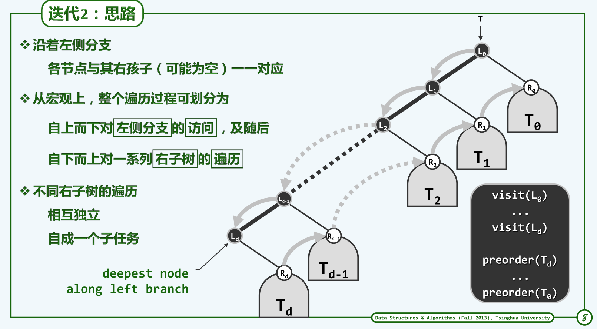
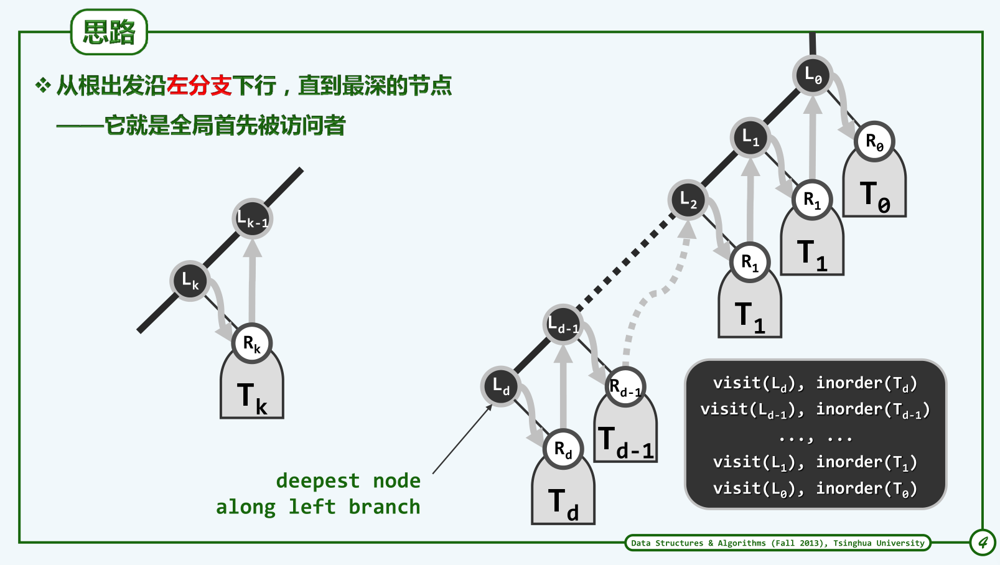
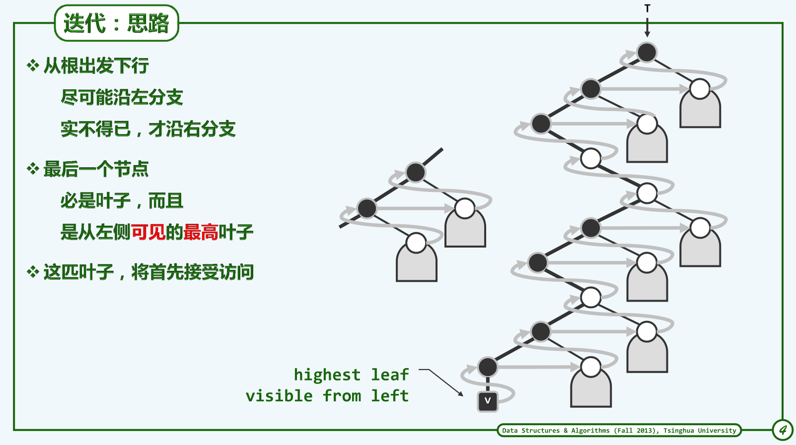

Conclusion on Chapter Five: Binary Tree
=======================================

## 知识脉络

本章讨论树与二叉树。树是一种层次结构，在现实生活中很多事物都具有分层结构，因此树在现实世界中具有大量的应用。为了把握树的结构，需要将它与线性结构以及图联系起来考虑，比如树是半线性结构，是连通无环图。

二叉树是树的一种特例，但是它却足以表示所有类型的树。这样，利用二叉树来作为算法的底层结构，不仅不失一般性，而且得益于二叉树结构的简洁性，问题的描述与实现反而可得到简化。

二叉树应用的关键在于遍历算法，按照根节点访问次序的不同，遍历可以分为先序遍历，中序遍历与后序遍历。对于这三种遍历算法，应该重点去把握它们的非递归形式。把握非递归形式遍历算法的关键，在于掌握每种遍历中各个节点实际的访问次序，比如第一个访问的节点，还有每个节点的直接后继等，借助图形有助于理解各种遍历的特点；此外还需要掌握算法的不变性，比如对于后序遍历而言，每个出栈的节点接受访问后，以该节点为根的子树就访问完毕，此后应该访问的节点是它的右兄弟（如果存在的话）或者父节点。借助这三种遍历中的某几个，可以重新构造一棵二叉树。此外，还有一种层次遍历，此时应该考察用到的辅助队列的规模的变化情况。

表达式树是二叉树的一个实例（只考虑双目运算符），对表达式树进行遍历可以得到不同形式的表达式，先序遍历得到前缀表达式(prefix)，中序遍历得到中缀表达式(inorder)，后序遍历得到后缀表达式(postfix or Reverse Polish Notation, RPN)。利用表达式树可以揭示一些规律，比如对表达式树的计算应该首先计算左子树，然后计算右子树，再将两者作用于根节点的运算符，这个过程恰好对应了二叉树的后序遍历，因此后缀表达式是易于计算的。

编码树是二叉树的另一个实例。一棵合法的编码树必须是前缀无歧义（prefix free coding, PFC)的。构造一棵编码树可以自底向上，依次将原字符集的各个子集的编码树合并，从森林中构造出编码树。为了提高编码效率，提出了叶节点平均深度(average leaf depth, ald)的概念，`ald`最小的编码树即为最优编码树，最优编码树具有`双子性`和`层次性`两个特性。可以证明，完全二叉树对应了一棵最优编码树，因此对于大小为`n`的字符集，可以直接构造一棵规模为`2n - 1`的完全二叉树来作为编码树。

在实际应用过程中，字符集中的各个字符出现的频率并非是完全相等的，在一般情况下往往具有很大的差别，此时最优编码树并非“最优”的编码策略。一种思路是出现频率高的字符编码长度更短，频率低的字符编码长度可以更长，这就是`Huffman树`的思路。`Huffman树`提出了基于权重的叶节点深度，即叶节点加权平均深度(weighed average left depth, wald)，此时的最优编码树应该满足`wald`最小。为了理解`Huffman树`的构造过程，关键在于把握`Huffman树`的结构性与层次性，以及字符集`T`与`T'`对应的编码树之间的关系，这样只要将权重最小的两个字符构造成一个`超字符`，问题的规模就可以减小1，重复这个过程就可以完成`Huffman树`的构造。

## 树形结构

> 什么是树形结构？

树是一种分层结构。而客观世界中很多事物都采取分层结构，例如域名，例如文件系统，例如家谱树，因此树可以在世界中有大量的应用。

和线性结构相比，树是一种半线性结构。这是因为树的每一个结点都是一个入度，多个出度。而线性结构如`Vector`或者`List`的每一个元素都是一个入度，一个出度，所以说树是半线性结构。另一方面，树的若干表示形式中，都蕴含了线性结构，例如邻接链表的表示中，每个结点的子结点形成了一个邻接链表，整棵树是有多个这样的线性的邻接链表组成，所以树是半线性结构。此外，在孩子兄弟表示法中，所有的孩子可以组成从根节点到叶节点的一个链表，每棵树也含有多个这样的链表，也构成了半线性结构。

从图的理论来讲，树是连通无环图。更详细地说来，是含有n个结点的最大无环图和最小连通图。

> 树的性质(深度和高度)。

树作为数据结构自然具有一些性质。例如像是入度出度这种，还有祖先结点父节点子结点，自不多言。

这里关键是对树的深度和高度做一个约定。树的深度从树根开始算起，并且树根的深度为零。树的高度从最低的叶节点开始算起，并且叶节点的高度为零。约定空树(`null`)的高度为-1。

## 二叉树

> 树与二叉树的区别与联系？

顾名思义，二叉树是树的一种特殊形式。但是二叉树又可以表示所有的树。这是因为在树的孩子兄弟表示法中，将某个结点的孩子指针作为它的左子树，将它的下一个兄弟指针作为它的右子树，通过这样的方式，可以将任意一棵一般的树表示成为一棵二叉树。

### 二叉树的一个实例：编码树

> 什么是编码树？

编码树其实是将编码的过程用一棵（二叉）树来表示。如果是将字符集进行二进制编码的话，就是对应二叉树，否则就是k叉树，k为编码的进制。

可以对编码树进行一些约定，例如对于二叉编码树，站在某个子树的根节点上，向左走是零，向右走是一，这样就可以通过沿着该编码树的一条路径行走，得到某个字符的二进制码值。

> 什么是前缀无歧义编码(PFC, Prefix-Free Code)？

考察一个例子，例如字符`M`被编码成二进制串`011`，而字符`N`被编码成二进制串`0110`。这样，在解码时，就有可能产生冲突。比如对于码串`011011...`，既可以将前三个`011`解码成`M`，也可以选择将前四个`0110`解码成`N`，这就是前缀有歧义编码。从二叉编码树的角度来看，这因为`M`和`N`处于二叉编码树的同一条路径上。究其根源，还是因为它们的前缀部分有冲突，一个字符的编码前缀是另一个字符的编码结果。

前缀无歧义编码就是相对上面的例子而言。要实现前缀无歧义编码，就是要避免编码的字符对应的二进制编码串，相互之间不得是前缀。要实现这个条件，其实就是使每个编码的字符在编码树上对应一个叶节点。这样，由于对于一棵树而言，从根节点到任意叶节点的路径唯一，解码过程也不再会出现歧义。在上面的例子中，出现的问题就是`M`并不是编码树的叶节点，而是`N`的父亲结点。

> 最优编码树。

即使做到了前缀无歧义编码，也还有众多编码方案。这么多的编码方案中应该如何选择呢？这就涉及到衡量不同编码方案的优劣。

在通信理论中，主要是考虑信息的传输效率。这样，如果针对同一个文本信息，某一个编码方案编码后得到的二进制码长度更小，那么这显然是一个更优的编码方案。最优编码树，就是对应这样一个最短的二进制码长度编码方案的编码树。

这里的一个衡量编码长度的指标是平均编码长度，也就是编码树中的叶节点平均深度(ald, average leaf depth)。所以最优编码树就是在所有的编码方案中，拥有最小的ald指标的一棵编码树。

> 最优编码树的性质。

双子性。这应该是是比较明显的，因为如果有一个结点只有一个子结点，就是说在这个结点处不存在`0`还是`1`的左右跳转，那么这个结点的编码是冗余的，所以完全可以用它的唯一子结点来代替这个结点，便可以获得一棵更优的编码树。

层次性。这是说所有的叶节点的深度相差不超过1，也就是说这棵编码树具有良好的平衡性。这也是可以理解的(严格证明也可以，这里略过)，因为只有保持良好的平衡性，叶节点才具有更小的平均深度，因为此时具有最小的树高。

> 最优编码树的构造。

从上面的讨论看出，最优编码树的一个例子就是完全二叉树。因此对于任意一个含有n个字符的字符集，可以直接构造一棵具有$2n - 1$个结点的完全二叉树，这即是一棵最优编码树。

从上面的讨论也可以看出，最优编码树并不是唯一的。这里的完全二叉树方案只是其中的一种。

> 关于完全二叉树。

完全二叉树具有一些良好的性质，这里做一个简单的说明。

对于任意一棵完全二叉树，在其层次遍历过程中，前$[\frac{n}{2}]$次迭代都有左孩子入队，且前$[\frac{n}{2}] - 1$次迭代都有右孩子入队。实际上，这也是完全二叉树的定义。现证明如下：

对于任意一棵完全二叉树，设其度为零、一、二的结点个数分别为$N_0, N_1, N_2$，所以总结点个数
$$
N = N_0 + N_1 + N_2
$$
该完全二叉树中的路径的条数满足
$$
N_1 + 2N_2 = N - 1 = N_0 + N_1 + N_2 - 1
$$
整理可以得到
$$
N_2 = \frac{N - N_1 -1}{2}
$$
$$
N_0 = \frac{N + 1 - N_1}{2}
$$
从而可以得到上面的结论。

这样，我们就可以理解，为什么上面最优编码树的构造可以直接取总结点的数量$N = 2N_0 - 1$了，这是因为对于编码树而言，根据其双子性，编码树不具有度为一的结点。所以$N_0 = \frac{N + 1}{2}$，从而可以得到$N = 2N_0 - 1$。

此外，对于二叉编码树，任意第k个结点（从一开始编号）的左孩子是第2k个结点，右孩子是第2k+1个结点（如果左右孩子都存在的话）。证明如下：

设当前第k个结点至少有左子树，高度为h，所以本层在当前结点前面的结点有$k - 2^{h}$个，换算到下一层在当前结点左子结点前面的结点就有$2·(k - 2^{h})$个。本层在当前结点后面的结点有$2^{h+1} - 1 - k$个，这样在当前结点和子结点直接就相隔了$2·(k - 2^{h}) + 2^{h+1} - 1 - k = k - 1$个路人，所以当前结点的左结点位于第$2k$个，右节点在第$2k + 1$个。

通过这种性质，我们就可以方便地存储完全二叉树，例如可以直接使用一个`Vector`来实现对完全二叉树的存储了。

> 哈夫曼编码(Huffman)

上面的最优编码树其实存在一些问题。它考虑了叶节点的平均深度，然后并没有考虑各个字符出现的频率往往是不一样的。例如英文字母`t`会比`j`出现的频率高出很多。在这样的情况下，最优编码树显然并不是最优，这让我想起之前的二分查找，看起来是平衡的，实际上却并不平衡，而后面的斐波拉契查找，看起来是不平衡的算法，实际上却是平衡的。这里也是同样的情况。

考虑字符出现频率，来构造出来的最优编码树是Huffman编码树。Huffman编码树也有两个显而易见的性质：

+ 双子性。同前
+ 层次性。这里的层次性与前面的层次性略有不同。这里的层次性是说拥有最低出现频率的两个字符必然同时位于编码树的最底层。为了便于讨论，不妨设他们俩互为兄弟结点。这个证明也是容易的，这里直接略过。

> Huffman编码树的构造。

首先将所有待编码的字符构造成只有一个元素的树，这样就形成了一个森林。每次取出森林中权值(出现频率)最低的两棵树，将它们作为子树合并成一棵更高的树，新生成树的权值为两棵子树之和。这样不断迭代，直到森林中只剩下一棵树，即为目标的Huffman编码树。

> Huffman编码树最优的证明。

针对某一个字符集$\Sigma$，考虑一棵带权编码树T，其带权平均叶节点深度(wald, weighted average leaf depth)为$wald(T)$。该字符集中权值最小的两个字符为`x`, `y`。

考察另一个字符集$\Sigma^{'} = (\Sigma \backslash \{x, y\}) \cup \{z\}$，即字符集$\Sigma$排除掉`x`, `y`，再添加一个字符`z`，其权重等于`x`, `y`权重之和。其编码树为$T^{'}$。可以证明，如果$T^{'}$是最优带权编码树的话，那么$T$也是一棵最优带权编码树。

设$T^{'}$的带权平均叶节点深度为$wald(T^{'})$，那么$T$的平均带权叶节点深度
$$
wald(T) = wald(T^{'}) + W_a + W_b
$$
假设$T$并不是最优带权编码树，则存在一个比$T$更优的编码树$T_1$，满足$wald(T_1) < wald(T)$，那么将$T_1$中`x`和`y`结点合并成为`z`结点，对应的编码树$T_{1}^{'}$满足$wald(T_{1}^{'}) = wald(T_1) - W_a - W_b < wald(T^{'})$，所以$T_{1}^{'}$是一棵比$T^{'}$更优的带权编码树，与假设矛盾。

## 二叉树的遍历

### 先序遍历

> 先序遍历递归算法。

这个就不多说了。关键还是体会它的思想，即首先访问根节点，再访问左子树，最后再访问右子树，这个顺序递归地进行。根据这样的思想，可以构思出一种递归进行先序遍历的方法。

> 先序遍历迭代算法。

在递归算法中，两个递归调用都处于函数中的最后的操作，类似于尾递归，因此不难写出迭代版本的遍历算法。由于左子树总是先于右子树访问，即使左子树中具有较高深度的结点，也会先于右子树中具有较小深度的结点，所以首先需要将右子树结点延迟缓冲起来，待访问了左子树中所有结点，再来访问右子树。因此，这里考虑使用一个栈。

每步迭代，都是首先访问当前结点。然后将右子树和左子树依次进栈。由于栈后进先出的性质，在下一次迭代中，左子树首先被弹出作为当前结点，将迭代过程继续下去。在某一次弹栈时，如果栈为空，则标志着当前结点访问完毕（左右子树都为空），并且所有祖先结点都访问完毕（栈为空），则循环结束。其具体的代码如下：

```cpp
template <typename T> template <typename VST>
void preOrder_It1(BinNodePosi(T) x, VST& visit){
	Stack<BinNodePosi(T)> S;
	S.push(x);
	while(!S.empty()){
		x = S.pop();
		visit(x->data);
		if(x->rightChild) S.push(x->rightChild);
		if(x->leftChild)  S.push(x->leftChild);
	} 
}
```

可以用数学归纳法证明，该算法是可以实现二叉树的先序遍历的（这里懒得写了，打公式真烦）。

> 先序遍历第二版迭代算法。

上面的算法固然是可以工作，但是它其实就是从递归来的，看它的代码，其实和递归差别不是很大，并不能揭示先序遍历的本质--访问每个结点的直接后继是谁？让人感觉有些美中不足。

为了写第二版算法，首先需要探究二叉树的先序遍历究竟是以怎样的先后次序进行。

从根节点开始，不断向左子树访问，直到当前结点x不拥有左子树，这也相当于左子树已经访问完毕，此时转入当前结点x的右子树。右子树访问完毕后，即以x为根的子树已经访问完毕，此时应该转入x父亲的右子树，随后是x父亲的父亲的右子树，然后是x父亲的父亲的...整个访问过程可以如下面这张图所示：



从上面的归纳以及这张图可以看出，先序遍历的过程可以总结为：自上而下对左侧分支进行访问，随后自下而上对右侧分支进行访问。由于右子树的访问是自下而上的，因此需要一个栈来实现延迟缓冲的功能。整体的代码如下：

```cpp
template <typename T> template <typename VST>
void visitAlongLeftBranch(BinNodePosi(T) x, VST &visit, Stack<BinNodePosi(T)> &S){
	while(x){
		visit(x->data);
		S.push(x->rightChild);
		x = x->leftChild;
	}
}

template <typename T> template <typename VST>
void preOrder_It2(BinNodePosi(T) x, VST &visit){
	Stack<BinNodePosi(T)> S;
	S.push(x);
	while(!S.empty()){
		x = S.pop();
		visitAlongLeftBranch(x, visit, S);
	}
}
```

这里的分析思路其实挺重要的，会一直延续到后面的中序遍历和后续遍历迭代版算法。

### 中序遍历

> 中序遍历递归版算法。

这个也直接略过了。反正就是说优先访问左子树，再访问根节点，最后访问右子树。通过这样的思路，要能设计出递归版的中序遍历算法。

> 中序遍历迭代版算法。

仿照先序遍历的思路，先分析中序遍历中各个节点访问的先后次序--谁是第一个被访问的结点，以及每个结点的直接后继又是谁？

同样是从根节点开始，不断地沿着左子树向下走。不同的是，这里向下行进的过程中不能访问当前结点，只有俟到当前结点的左子树完成访问时，才能轮到当前结点，因此想到引入一个栈来实现延迟缓冲的功能。走到最左侧的第一个没有左子树的叶子结点时，没有左子树也相当于已经完成了左子树的访问，于是随后便访问当前结点x，然后转入到x的右子树。

当x的右子树完成访问时，即标志着以x为根的子树访问完毕，随机访问x的父亲结点，然后访问x的父亲的右子结点。x的右兄弟结点访问完毕时，即标志着以x的父亲的根的子树访问完毕，随机访问x父亲的父亲，然后是x父亲的父亲的父亲...整个访问过程如下图所示：



所以中序遍历迭代版的算法如下：

```cpp
template <typename T>
void goAlongLeftBranch(BinNodePosi(T) x, Stack<BinNodePosi(T) &S){
	while(x){
		S.push(x);
		x = x->leftChild;
	}
}

template <typename T> template <typename VST>
void inOrder_It1(BinNodePosi(T) x, VST &visit){
	Stack<BinNodePosi(T)> S;
	while(true){
		goAlongLeftBranch(x, S);
		if(S.empty()) break;
		x = S.pop();
		visit(x->data);
		x = x->rightChild;
	}
}
```

> 中序遍历非递归算法的优化。

上面的代码固然已经甩递归算法几条街了。但是这里还是用到了一个栈，栈的最大高度等于二叉树的最大高度，即需要额外的$O(h)$的空间复杂度，在最坏的情况下与n相当。现在考虑在空间上对该算法进行优化。

由于前面二叉树结点的定义中，还定义了一个指向`parent`的`BinNodePosi(T)`变量。是否可以利用这个变量来实现访问的回溯，从而规避栈的使用。具体的代码如下：

```cpp
template <typename T> template <typename VST>
void BinNode<T>::inOrder_It2(VST &visit) {
	BinNodePosi(T) curr = this;
	bool backTrack = false;
	while(curr){
		if (!backTrack) {
			while (curr->leftChild) curr = curr->leftChild;
			backTrack = true;
		}
		else{
			visit(curr->data);
			if (curr->rightChild) {
				curr = curr->rightChild;
				backTrack = false;
			}
			else{
				while (curr->parent && curr == curr->parent->rightChild) curr = curr->parent;
				curr = curr->parent;
			}
		}
	}
}
```

上面的算法主要讨论了两种情况：回溯与非回溯。

+ 非回溯代表了一开始的情形，以及从某个子树的根节点刚转入其右孩子的情形，对于非回溯的情况，不断地沿着左边路径向下移动，直到当前结点不再具有左子树。前面说过，没有左子树相当于左子树访问完毕，即左子树访问完毕后回溯到当前结点，因此设回溯标志`backTrack`为`true`。

+ 回溯表示某个结点的左子树或者右子树访问完毕后，回溯到当前结点的情形。如果当前结点有右子树，则去访问右子树，并且将回溯标识`backTrack`置`false`。而如果当前结点没有右子树，也代表了右子树访问完毕，亦即以当前结点为根的子树访问完毕。如果当前结点是右边结点的话，则继续上溯，代表路径上的各个祖先结点都已经访问完毕。直到当前结点是左边结点，代表当前结点父亲的左子树访问完毕，接下来应该访问父亲结点。由于仍然是回溯的情形，这里不修改回溯标志位。需要注意的是，通过这种方式回溯得到的结点，其右子树一定是尚未访问过的。

### 后序遍历

> 后序遍历递归算法。

和前面一样。所谓后续遍历，就是先访问左子树，再访问右子树，最后访问根节点，递归的进行下去。同样地，需要设计出相应的非递归算法。

> 后序遍历非递归算法。

首要的还是分析后续遍历各个节点之间的先后次序--哪个结点首先被访问，每个结点的直接后继是谁？

从根节点出发，不断沿着左子树向下进行，直到当前结点不具有左子树。此时应该进入右子树，然后重复上面的过程。这样，第一个被访问的结点，应该是最高左侧可见结点，即从左边向右看过去，未被遮挡的最高叶节点，该结点既可以是左节点，也可是右节点。从而，显而易见，这里也需要引入一个栈来实现延迟缓冲的作用。根据上面的分析，应该是当前结点首先入栈，其次是右孩子，最后是左孩子。

当一个结点访问完毕时，代表着以该结点为根的子树访问完毕，此时应该弹栈以访问下一个结点。此时弹栈无非两种情况：

+ 当前结点是左结点。则弹栈的结点是当前结点的右结点。对右结点的处理应该继续迭代地访问右结点的最高左侧可见结点。
+ 当前结点是右结点。则弹栈的结点是当前结点的父结点。此时应该访问当前结点，然后直接进入下一步的迭代，再次进行弹栈操作。

后续遍历的访问过程如下图所示：



综上所述，后序遍历的非递归算法如下：

```cpp
//Highest Leaf Visible From Left
template <typename T>
void goHLVFL(Stack<BinNodePosi(T)> S){
	BinNodePosi(T) x;
	while(x = S.top()){
		if(x->leftChild){
			if(x->rightChild) S.push(x->rightChild);
			S.push(x->leftChild);
		}
		else S.push(x->rightChild);
	}
	S.pop();
}

template <typename T> template <typename VST>
void postOrder_It(BinNodePosi(T) x, VST &visit){
	Stack<BinNodePosi(T)> S;
	S.push(x);
	while(!S.empty()){
		if(S.top() != x->parent) goHLVFL(S);
		x = S.pop();
		visit(x->data);
	}
}
```

### 层序遍历

层序遍历是按照自上而下，自左而右的次序遍历，不涉及任何的逆序，延迟缓冲之类的操作。因此就不使用栈了，转而使用队列。代码略过不表。

## 树的重构

> 通过中序遍历 + 先序（/后序）遍历重构二叉树。

这简直就是废话。简单说来就是通过先序（/后序）遍历的头部（/尾部）找到根结点，然后去中序遍历中找到这个点，从而就可以通过中序遍历中的这个点把左子树和右子树分开。然后这个过程递归的进行下去。

> 是否可以通过先序遍历 + 后序遍历重构二叉树？

可以先分析一下。假设现在同时有先序遍历序列和后序遍历序列，先序遍历的第一个结点是头部，第二个结点是左子树的根节点。通过这个左子树的根节点在后序遍历序列中进行查找，左子树根节点在后序遍历序列中左子树序列的最后，从而可以将左子树和右子树给分开，然后递归地进行下去。

一切都挺完美的，但是我们来考虑一下特殊情况。假设某棵子树只有左子树而没有右子树，那么其先序遍历序列是`Root + LeftRoot + Left`，后序遍历序列是`Left + LeftRoot + Root`。再假定某棵子树只有右子树而没有左子树，那么其先序遍历序列是`Root + RightRoot + Right`，后序遍历序列是`Right + RightRoot + Root`。可以注意到，两种情况下的先序遍历与后序遍历序列是相同的，就是说通过这样的遍历序列，我们无法判断当前结点的唯一子树是左子树还是右子树，从而无法重构二叉树。

通过上面分析也可以看出，在一定条件下，还是可以通过先序遍历序列和后序遍历序列来重构二叉树的，只需要不发生上面提到的某个结点只有一个孩子的情况就可以了。所以，如果二叉树是一棵真二叉树，即只存在度为零或为二的结点，不存在度为一的结点，则可以通过先序 + 后序来实现树的重构。
