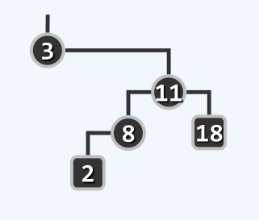
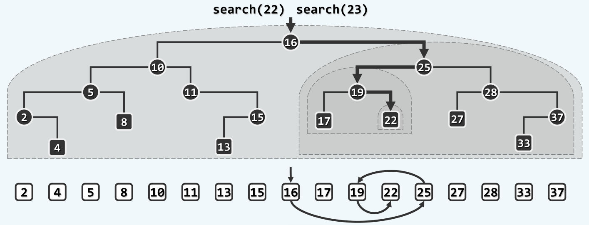

Conclusion on BST
=================

## BST与BBST知识脉络

理解二叉搜索树的关键在于它的定义，即对于任一节点，其左子树的所有节点均不大于它，右子树的所有节点均不小于它，即`局部有序性`；通过二叉搜索树的`局部有序性`，可以证明得到它的`全局单调性`，因此可以仿照有序向量，在二叉搜索树上实现高效的查找算法。对二叉搜索树的动态操作，即插入与删除，关键也在于维护它的`局部有序性`。因此对于插入操作，首先需要调用一次`search`接口定位插入的位置；而对于删除操作，如果被删除节点没有左子树或者右子树，则可以用它的另一棵子树来替代它，如果同时具有左右子树，则需要用它的直接后继来替代它，随后删除一定没有左子树的直接后继。

容易注意到，二叉搜索树的搜索操作非常类似`二分查找`，但是它存在的问题是每次比较的节点未必就是中间节点，即它的`平衡性`问题——在最坏的情况下，二叉搜索树退化为单链表，其搜索操作的时间复杂度也退化为`O(n)`。为了保持二叉搜索树的平衡性，需要增加一些结构上的限制条件，即平衡条件，这样的二叉搜索树就成为了平衡二叉搜索树。对于任何一种`BBST`，都需要关注两个问题，即平衡条件和失衡调整算法。

`AVL树`使用`平衡因子`作为它的平衡条件，`平衡因子`本身也只是一个局部性质，但是通过`平衡因子`可以推导证明整棵`AVL树`的平衡性，即对于任意高度为`h`的`AVL树`，节点数量`n >= fib(h + 3) - 1`，即`h = O(logn)`。为了维护`平衡因子`条件，需要对动态操作即插入和删除进行一些修改——无论是插入还是删除，都首先调用`BST`的插入和删除算法，随后再利用`3+4重构`对失衡的节点进行修正。需要注意的是，插入操作至多进行一次`3+4`重构，全树即可恢复平衡；而删除操作至多却需要`O(logn)`次局部的修复才能恢复平衡。

相对于`AVL树`，`Splay树`则显得更加潇洒——它并没有维护任何的平衡条件。伸展树的基本思想是`局部性原理`，简单地通过`双层伸展策略`，伸展树即可保证其所有操作的分摊时间复杂度为`O(logn)`。需要注意的是，伸展树单次操作的时间性能可能有很大的波动，因此不适用于对性能要求很高的场合。在伸展树的插入和删除操作中，也需要贯彻`局部性原理`——对于插入操作，可以首先对待插入的关键码进行查找，随后比较其与新的根节点之间的大小，从而将新的节点插入到根节点；对于删除操作，也是首先查找一次待删除关键码，将它伸展到根节点，随后再删除；为了找到新的根，可以对右子树调用一次`search(e)`，该查找必然会失败，却会将被删除节点的直接后继移动到根节点，并且新的根必然没有左子树，因此实现左右子树的合并。

`B树`是为了解决多级存储介质速度不匹配的问题而产生的一种数据结构。它的本质是`多路平衡搜索树`，实际上，将二叉树的多层次节点合并，即可构成一个`B树`的`超级节点`。对于`m`阶`B树`，它的定义是除了根节点外，所有节点的分支数都介于$\left \lceil m/2 \right \rceil \sim m$的多路平衡搜索树，对于根节点，其分支数则介于$\left \lceil 2 \right \rceil \sim m$之间。`B`树的搜索仍然是仿照`BST`的策略进行，为了维护`B`的结构，需要对它的插入和删除算法进行一些分析。对于插入，有可能会导致内部节点的`上溢`，解决`上溢`的方法是对超级节点进行分裂(split)，将`上溢`的超级节点一分为二，同时将它的中间值添加到父节点中，容易看出，这可能会将`上溢`传递给父节点，一旦`上溢`传递到根节点，`B树`的高度就会增加一个单位；对于删除操作，则可能导致`下溢`，解决`下溢`有两种方法，即`左顾右盼`与`合并`，其中`合并`操作有可能将`下溢`向父节点传递，一旦传递至根节点，会导致`B`树高度减小一个单位。

`红黑树`则具有更加奇怪的平衡条件（四条），实际上`红黑树`与`B树`具有非常紧密的联系——将红黑树的红色节点向上依附于黑色节点，就构成了一棵`2-4B树`，因此`红黑树`的黑色高度(black height, bh)即等于与之对应的`B树`的高度，这样以来`红黑树`的平衡性就不证自明了。对于`红黑树`的失衡调整算法的理解，关键也在于将它转化为等效的`B树`，通过`B树`的上溢和下溢算法调整来理解。

对于插入操作，可能会出现`双红缺陷`(double red)，此时需要对被插入节点的叔父节点进行讨论，如果叔父为黑色节点，则做一次`3+4重构`即可，等效于`B树`中交换相邻的红黑节点的颜色；如果叔父的红色节点，则对应于`B树`中的`上溢`，此时只需要将祖父染成黑色，而将父节点和叔父节点都染成红色，即可在这一局部解决`双红缺陷`，但需要注意的是，`双红缺陷`可能在祖父节点再次出现。这对应了`B树`中解决`上溢`的`split`操作，分裂节点后可能导致上一层节点继续`上溢`。

对于删除操作，可能会出现`双黑缺陷`(double black)，对应了`B树`中的`下溢`。为了解决`下溢`，首先需要`左顾右盼`，因此首先要找到下溢节点的邻居节点，记为`s`。当下溢节点的兄弟节点为黑色时，`s`即为该兄弟节点，如果`s`有红色的孩子，意味着从`s`借一个孩子即可解决`双黑缺陷`，对应了红黑树中对`s`的红色孩子进行一次`3+4重构`；如果`s`全是黑色的孩子，则无节点可借，为此只能进行节点的合并。如果父节点`p`为红色，则意味着上层超级节点有多余的节点可供合并，合并后并不会引起更高层的`下溢`，这对应了红黑树中将`p`和`s`交换颜色；如果父节点`p`为黑色，意味着上一层的超级节点则在`下溢`的边缘，合并后必然引起`下溢`向高层传递，这对应了红黑树中将`s`染红，然后`双黑缺陷`向上传递两层，即假想地认为刚刚删除了`p`的黑色父亲。

上面的讨论都是基于`s`就是被删除节点的兄弟节点，而如果`x`的兄弟节点是红色，`s`应该是`x`的兄弟节点的孩子节点，此后还需要对该孩子节点进行类似于上面的讨论，未免过于复杂。为了对问题进行简化，不妨简单地将`s`和`p`进行一次单旋转，并且交换它们的颜色，这对应了`B树`中将超级节点中的`s`和`p`交换颜色，此时虽然并没有解决`双黑缺陷`，可是这样交换以后，`s`必为黑色节点了，并且`p`是红色节点，因此问题就转化成了上面讨论过的第一种或者第二种情况。

容易看到，对于红黑树的失衡调整算法，一旦进行了一次结构调整，全树必然恢复平衡，因此红黑树的每次的结构调整量仅为`O(1)`，而`AVL树`只有插入的调整才能做到这点，其删除算法至多会进行`O(logn)`次结构调整。

`k-d树`(k-dimentional tree)是为了支持高效的多维数据`范围查询`问题而产生的，它的关键在于构造算法和查询算法。`kd树`的构造是依次按照不同的维度，选择该维度的中位点对（k维）空间进行切分，直至每个小区域内部只有一个节点。为了进行多维数据的`范围查询`，则需要递归地判断查询区间与当前区域的关系，即包含，不相交或是相交，只有在相交的情况下才需要递归地进行查询。

## 什么是二叉搜索树(BST, Binary Search Tree)

> 为什么要有BST，它有哪些优势吗？

从名字就可以看出，BST是为了搜索而生的，是为了实现高效的搜索算法。

对比此前的数据结构，有序的`Vector`虽然可以实现$O(logn)$的搜索算法，但是为了维护这种有序性，对`Vector`本身的修改则需要线性的$O(n)$时间，这种性能多少有点糟糕。

再对比此前的`List`，无论是有序抑或是无序的`List`，搜索算法都需要$O(n)$的时间复杂度。但是，与之相应的，`List`具有比较好的动态性能，插入和删除算法只需要$O(1)$的时间。

这样，我们希望可以有这样一种结构，可以同时支持高效的查找算法的同时，还可以轻易地维护它的这种性质，即也支持高效的插入和删除算法。

> BST的思想。

通过上面的分析，其实我们想要的是这样一种数据结构，它可以同时具有`Vector`高效的静态性能以及`List`高效的动态性能。

实际上，BST正是这种数据结构。概括地说，就是形似`List`，神似`Vector`。

所谓形似`List`，是指BST在结构上与`List`相似。例如都通过指针来索引相邻的数据。实际上，退化的BST本身就是一个`List`。

而神似`Vector`，是指BST的搜索算法与`Vector`的二分查找有异曲同工之妙，这个我们会在后面看到。

> 什么是BST？

BST的定义是，对于树中的每一个结点，都满足顺序性，即任意结点w的左子树中，所有结点不大于w；w的右子树中，所有结点不小于w。

关于这个定义，要注意的是这里必须强调是左右子树的所有顶点都要满足顺序性，而不是<左孩子不大于w，右孩子不小于w>。例如，下面这棵树就不是一个BST。



> BST的整体单调性。

我们说，任何一棵BST，都是满足整体单调性的，即中序遍历序列必然单调非降。也就是说，BST的局部有序性可以推出整体单调性。如下面这张图所示：


这个性质可以证明如下：

+ 先考虑平凡的情况。例如一棵BST只包含三个结点，分别是根节点r以及左右子树l和r。显然，通过根节点的局部有序性可以直接退出整棵树中序遍历序列的单调性
+ 对于任意一棵树T，可以将其划分为根节点r，左子树$T_{left}$，以及右子树$T_{right}$，假定左子树以及右子树都满足单调性。考虑整棵树的中序遍历序列，必然是`[left-nodes, root, right-nodes]`这样一个序列，其中子序列`[left-nodes]`以及`[right-nodes]`都是单调非降的。由于左子树的所有顶点不大于`root`，右子树的所有顶点不小于`root`，因此整个`[left-nodes, root, right-nodes]`序列仍然是单调非降的。因此树T也满足单调性

这样，就证明了BST的局部有序性可以推导出整体的单调性。

通过这种性质，我们可以快速地判断一棵树是否是BST，即得到它的中序遍历序列（将所有结点往树底方向投影就可以得到），如果中序遍历序列有序，那么该树就是一棵BST。实际上，中序遍历序列单调非降也是BST的充要条件。

## BST的实现

和各种数据结构一样，BST的实现主要包括两部分，一是高效的查找算法，还有就是对原树的修改，比如插入和删除算法。需要注意的是，插入和删除算法中，比如维护BST的这种局部有序性，这是BST算法的核心。

> BST的查找算法。

与此前的`Vector`以及`List`不一样，BST的访问方式既不是循秩访问(call by rank)，也是循位置访问(call py position)，而是循关键码访问(call by key)，这是因为数据在BST中的存储位置只与数据的关键码有关。这已经有点类似于`python`的`dict`类型或者`cpp`的`map`类型，实际上，这些数据结构的底层就是BST，不过是平衡的二叉搜索树(BBST, Balanced BST)。

利用BST的局部有序性，可以高效地实现对目标算法的查找。这个问题这里就不讲了，毕竟太基础。但是我们可以看一下这个算法的运行过程，如下图所示：



可以看到，BST的整个搜索过程是在仿照有序向量的二分查找，只不过这里的有序向量就是BST的中序遍历序列。这也是前面说BST神似`Vector`的原因。

从这个过程也可以看出，BST的查找其实也不是真正的<二分查找>，这取决于整棵树是否平衡。在退化为`List`的情况下，BST的查找其实就是`List`的元素遍历，这也是BST的局限性。

与`Vector`一样，BST的查找算法也是需要服务于后续的插入、删除等操作，因此其接口语义的定义非常重要。为了方便地实现后续的插入操作，这里以引用的方式来传递树的结点，具体的代码如下：

```cpp
BinNodePosi(T)& BST<T>::searchIn(BinNodePosi(T) &x, T const &key, BinNodePosi(T) &hot){
	if(!x || x->data == key) return x;
	hot = x;
	return searchIn(key < x->data? x->leftChild: x->rightChild, key, hot);
}

BinNodePosi(T)& BST<T>::search(T const &key){
	searchIn(__root, key, __hot);
}
```

这里的技巧主要在于利用`__hot`内部变量来保存被查找结点的父结点，即使被查找结点为`nullptr`，`__hot`仍然会指向它的父结点，从而后续的插入和删除操作就可以方便地进行。

> BST的插入算法

BST的插入算法主要要考虑的问题是不能破坏BST的局部有序性，为此可以先通过调用一次查找算法来找到被插入结点应该存在的位置，随后利用被返回的结点以及`__hot`变量，可以方便地实现插入操作，代码如下：

```cpp
BinNodePosi(T) BST<T>::insert(T const &key){
	BinNodePosi(T) &pos = search(key);
	if(pos) return pos;								//key already exists
	//else
	pos = new BinNode(key, __hot);
	++__size;
	updateHeightAbove(__hot);
	return pos;
}
```

需要注意的是，由于这里的`pos`以及`search`函数的返回值都是引用，因此这里的`pos`直接就是原树中的指针变量。利用这种方法可以使得相关操作更加便捷，例如插入根结点和插入普通结点并没有什么区别，同时也不需要修改从父结点指向当前结点的指针。但我觉得这种做法得不偿失，使得整个代码非常难以维护，同时很容易出错，正常地返回值然后手动修改指针我觉得也没有麻烦多少。

>  BST的删除算法。

和BST的查找一样，BST的删除算法也需要保证不改变BST的局部有序性，为此需要对删除了当前结点的树做一些调整，使之重新成为一棵BST。具体的调整方法如下：

+ 如果被删除结点没有左子树或者没有右子树，那么就可以直接用它的右子树或者左子树来替代它，就可以在删除结点的同时保持了BST的性质。
+ 如果被删除结点既有左子树，又有右子树，可以找到它的直接后继`succ()`，用直接后继的数据来替代当前结点的数据，随后删除直接后继结点，而这里的直接后继是一定没有左子树的。

具体的代码如下：

```cpp
BinNodePosi(T) BST<T>::removeAt(BinNodePosi(T) &x, BinNodePosi(T) &hot){
	BinNodePosi(T) succ;
	if     (!x->leftChild)  succ = x = x->rightChild;
	else if(!x->rightChild) succ = x = x->leftChild;
	else{
		succ = x->succ();
		x->data = succ->data;
		if(succ == succ->parent->leftChild) succ->parent->leftChild = succ->rightChild;
		else succ->parent->rightChild = succ->rightChild;
		hot = succ->parent; 						//update hot
		succ = succ->rightChild;
	}
	if(succ) succ->parent = hot;
	return succ;
}

bool BST<T>::remove(T const &key){
	BinNodePosi(T) x = search(key);
	if(!x) return false;							//key doesn't exist
	//else
	removeAt(x, __hot);
	--__size;
	updateHeightAbove(__hot);
	return true;
}
```

这里同样使用了树结点指针的引用，来方便地修改一些连接关系，同时`__hot`在调用了`remove`后，指向被实际删除结点的父结点。
