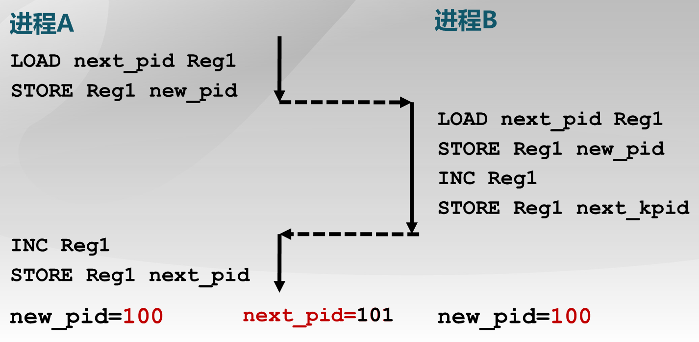

进程管理（3）：同步互斥
=====================

## 什么是同步互斥问题？

引入了进程和线程的概念以后，多个进程和线程可以并发地在处理器中执行。在实际应用中，它们并不是独立地自己执行自己的，有时候会存在多个进程协作完成一个更大的任务。例如前面在[进程管理(1)：线程和进程的概念](chp11.md)中提到的例子，一个MP3播放器软件，被划分为I/O读取数据，解压数据，和播放解压后的音频文件三个子模块，我们可以使用三个线程来实现这三个子模块，I/O操作总是把数据读到某一个缓冲区，解压操作则到这个缓冲区去读取数据。考虑一种情况，由于线程的调度，解压的线程先于I/O的线程得到执行，此时它去读取缓冲区的数据，就只能得到无意义的数据。

上面这个例子说明了进程之间同步运行的概念，即一些进程的操作一定要先于另一些进程的操作执行，否则就会导致致命性的问题。同步又称为进程之间的直接制约关系，它本质上是源于进程之间的相互合作。

互斥问题则更加普遍，在没有协作的进程之间也有可能发生。例如在前面讲过，在进程创建时，需要为它分配唯一的标志符`pid`，具体的操作通过内核函数`get_pid`来实现。其中的主要操作是：

```c
new_pid = next_pid++;
return new_pid;
```

这里的`next_pid`存储了下一个可用的`pid`，进程申请`pid`时，直接将这个`next_pid`分配给该进程即可，然后`next_pid++`存储下一个可用的`pid`。上面代码的汇编指令是：

```asm
LOAD  next_pid REG1
STORE REG1 new_pid
INC   REG1
STORE REG1 next_pid
```

考虑有两个新创建的进程都请求操作系统分配一个新的`pid`，假定当前`next_pid = 100`，则预期两个进程被分配到`pid = 100`和`pid = 101`，并且`next_pid`增加到`102`。但是如果在为一个进程分配`pid`时发生了调度，例如在第二行调度到了另一个进程，如下图所示：



程序执行完毕后，两个进程都将分配到`pid = 100`，并且`next_pid = 101`，这对于操作系统显然是一个致命性的错误。

这个例子说明，对于操作系统中某些共享资源，例如外部设备，全局变量，一次是只允许一个进程访问的，否则就会出现难以预料的错误。互斥就是指进程之间这种访问的制约关系，又称为间接制约关系，这里要互斥访问的资源，被称为临界资源。以下首先探讨如何解决互斥问题。

## 临界区的概念

临界区(`critical section`)是指进程中访问临界资源的一段需要互斥执行的代码。在进入临界区之前的区域被称为进入区(`entry section`)，通常需要在该段区域获得对资源的互斥访问权限。临界区之后的部分被称为退出区`exit section`，在这里释放资源的互斥访问权限。剩下的区域成为剩余区。这样，进程的代码就组织成了下面的形式：

```
entry_section
{
	critical_section
}
exit_section
remainder_section
```

对临界区的访问原则，可以抽象为下面的四条规则，即

+ `忙则等待`；指有进程在临界区时，其他想要进入临界区的进程必须等待。
+ `空闲则入`；指没有其他进程访问临界区时，可以对临界区进行访问。
+ `有限等待`；等待临界区资源的进程不能无限地等待下去。
+ `让权等待`；指进程在等待进入临界区时，应该放弃CPU的使用权，进入阻塞状态。这一条是可选的。

为了实现上面四条对临界区的访问规则，有三种具体的方式，即禁用中断、软件方法和高级抽象方法，将在下面一一进行叙述。

## 禁用中断

对上面的互斥问题进行分析，可以发现，之所以会引发临界区的冲突访问，其根源在于一个进程在访问临界区时发生了进程的调度，使得另一个进程也进入了临界区进行访问。因此，我们可以从根源上来解决这个问题，即在进程访问临界区时禁止调度，禁用中断就是这样一种方法。

这样，访问临界区的代码，就可以组织成下面的形式：

```c
local_irq_save(unsigned long flags); 
critical_section
local_irq_restore(unsigned long flags); 
```

即在进入临界区之前禁用中断，执行完临界区代码后再使能中断。为了禁用中断，需要将`cr0`寄存器中的中断标志位`FL_IF`清零，在使能中断时再将该位置一。所以看到在禁用中断时需要保存当前的状态标志，在使能中断时恢复这些状态标志。

这种方法是切实有效的，只是容易看出，稍微有点简单粗暴。在禁用中断后，当前进程就不能被停止，如果此时进程出现了错误，就会导致整个系统都停止运行；又或者临界区可能很长，此时将不能响应硬件中断了。因此，这种方法需要小心使用，一般只有在迫不得已的时候才使用。

## 软件方法

为了实现临界区的互斥访问，另一种想法是所有要进入临界区的进程共享一些访问标志位，首要进入临界区的进程通过设置这些标志位“通知”其他进程【我已经在临界区了嘻嘻嘻，你们现在不能进来】，这就好比在农村上厕所，又没有锁，只能在厕所外放置一条红丝带之类的东西来告知【已经有人了】。这种方法就是软件方法，它的本质其实是进程之间的通信，可以看到是不需要操作系统参与的，因此开销比较小。

我们可以根据这里的思想，才尝试着实现一下软件方法，为了简单起见，首先我们只考虑两个进程的情况。比如我就设置一个占用标志位`occupied`，一个进程在进入临界区之前先判断这个标志位，只有在`occupied == false`的时候再进入临界区，并且同时设置`occupied = true`。在退出临界区时在释放标志位，可以形成下面的伪代码：

```c
while(occupied == true); 	// wait for other processes to exit
occupied = true;
critical_section
occupied = false; 			//exit
```

看起来是很理想的，但是稍微分析可以发现，当`occupied = false`，如果两个进程同时想要进入临界区，在第一个进程通过了`while`循环后进行了调度，此时第二个进程也会通过`while`循环进入临界区，也就是说这种方案不满足`忙则等待`原则。

为了解决上述问题，可以不让两个进程同时进入临界区，而是让它们依次进入。为此，可以设置一个`turn`标志，表示当前应该是谁去<del>上厕所了</del>进入临界区了。进程在进入临界区之前首先判断`turn`是否等于自己的`pid`，如果是则进入临界区，否则就等待；退出临界区时应将`turn`标志位设置成另一个进程。可以形成下面的代码：

```c
//code for process i
while(turn != i); 			// wait for my turn to enter
critical_section;
turn = j;					// exit
```

通过分析可以发现，采用这种策略后，两个进程只可能有一个可以通过`while`循环，因此不会出现上面两个进程同时进入临界区的情况，即满足了`忙则等待`条件。但是，考虑下面一种情况，当前`turn == j`但是进程`j`并不想进入临界区，此时进程`i`只能一直等待`j`进入了临界区后才能执行临界区代码，不满足`空闲则入`原则。简单说来就是占着茅坑不拉屎。

还有两种基于第一种方案的改进，一种是为每个进程都分配一个标志位`flag[i]`，表示这个进程是否在临界区，进程在进入临界区前首先检查另一进程的标志位是否为`true`，否则进入，并且设置自己的标志位。这种方案又称为`双标志先检查法`，通过分析可以看出，它同样不满足`忙则等待`原则。

为了解决`双标志先检查法`的问题，提出了`双标志后检查法`，即进程在进入临界区前首先设置自己的标志位`flag[i] = true`，表示当前进程想要进入临界区，随后再检查另一进程的标志。这种策略的确可以解决`忙则等待`原则，但是却不满足`空闲则入`原则，也是不可行的。

### `Peterson`算法

经过上面四种方案尝试失败后，我终于意识到，原来软件方法并不是想象中那么简单。难怪成功解决这个问题的人用他的名字命名了这个算法，就是这里的`Peterson`算法。

实际上，`Peterson`算法是上面几种方法的综合，它同时采用了`turn`标志位和双标志位。具体的代码如下：

```c
//code for process i
flag[i] = true; 							// current proc want to enter
turn = j;
while((turn == j) && flag[j] == true);		// wait for proc j
critical_section;
flag[i] = false;							//exit
```

如果两个进程同时都想要进入临界区，它们都会首先设置自己的标志位表示想要进入临界区，实际上，这就是双标志后检查法，通过前面的分析，它会保证`忙则等待`原则，却不能保证`空闲则入`原则。而这里的`turn`就是为了保证`空闲则入`，如果两个进程都想要进入临界区，此时`turn`的值只能有一个，因此必然有一个进程可以通过`while`循环。可见，`Peterson`算法是利用双标志位解决临界资源的互斥访问，用`turn`解决饥饿现象。

通过对进程调度的所有情况进行分析，可以证明`Peterson`算法是正确的，它的确可以做到两个进程之间临界资源的互斥访问。

### `Dekkers`算法

`Dekkers`算法是另一种软件解决同步互斥问题的方法，它的本质和`Peterson`算法是一样的，都是利用双标志位`flag[]`和`turn`来实现的。具体的伪代码如下：

```c
flag[i] = true;
while(flag[j] == true){ 
    if(turn != i){ 
       flag[i] = false 
       while(turn != i); 
       flag[i] = true 
    }  
} 
critical_section
turn = j
flag[i] = false;
```

在`Dekkers`算法中，总是拥有`turn`的进程优先，另一个进程需要等待拥有`turn`的进程执行完临界区后，才可以进入临界区，即`忙则等待`原则；但是如果拥有`turn`的进程不想进入临界区，另一个进程也可以直接进入，即`空闲则入`原则。通过对所有可能的进程调度情况进行分析，可以证明`Dekkers`算法也是正确的。

然后老师说，为什么要在`Peterson`算法的基础上再引入`Dekkers`算法呢？是因为`Dekkers`算法是可以方便地扩展到多进程的情形。我还以为多方便呢，就自己想了想，结果发现问题并不简单。问题的分析过程以及多进程下的互斥软件方法`Eisenberg`算法，可以查看这篇文章[`Eisenberg`算法实现多进程互斥访问](eisenberg.md)。

### 软件解决方法评价

可以看到，软件方法来实现互斥访问非常复杂啊，设计算法很复杂，证明一个算法可以正确运行也很复杂，需要穷举所有可能的情况，从我的学习时间来看，研究这点内容用了一个下午就足以说明它有多复杂了......

然后实现软件方法需要在进程之间共享数据，对于进程数量较多的情况，问题就更加复杂，想想都觉得烦！以及从上面的实现中可以看到，等待访问临界区的进程，并没有做到`让权等待`原则，而是在忙等待，这是需要消耗CPU时间的。实际上只有没有操作系统的参与，是不可能`让权等待`的。
