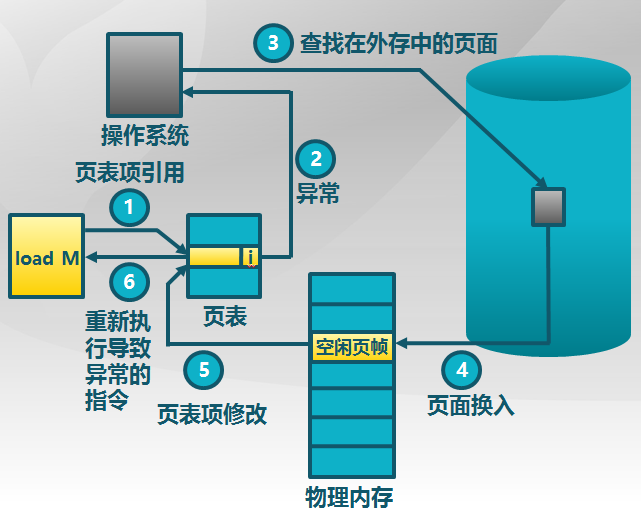

虚拟存储总结
===========

## 虚拟存储产生的背景

在计算机发展的过程中，程序规模的增长速度是远远大于存储器容量的增长速度的。于是喜欢做梦的人类就产生了一些不切实际的幻想，比如[如果我可以回到十年前就好了！]，或者[如果我可以使用的存储空间比实际存储空间大该多好啊！]与别的白日梦不同的是，这个白日梦还真实现了。于是人们就开始了实现这个白日梦的探索工作。覆盖和交换技术就是其中两个具体的实践。

> 覆盖技术的基本原理

覆盖是用于还是单道程序时期的，那时候的内存空间实在太小了，以至于连一个进程都容不下，覆盖可以实现在小内存中运行较大的程序。覆盖的基本思想是，一次只将部分程序装入内存中，当需要访问不在内存中的程序时，再将其调入内存中，覆盖原有的内存区域。

为了实现覆盖技术，需要依据程序逻辑结构，将程序划分为若干功能相对独立的模块；将不会同时执行的模块共享同一块内存区域。整个程序将被划分为[必要部分]和[可选部分]，必要部分（常用功能）的代码和数据常驻内存，可选部分（不常用功能）放在其他程序模块中,只在需要用到时装入内存。不存在调用关系的模块可相互覆盖，共用同一块内存区域。一个覆盖的实例如图所示：


很明显，覆盖技术是不能由操作系统自动实现的，因为需要根据程序的逻辑结构来确定哪些模块是可以覆盖的，操作系统并不能判断程序内部的逻辑结构，因此需要程序员手动来划分功能模块，给编程带来了困难。

> 交换技术的基本原理

与覆盖不同，交换是用于多道程序的系统当中的。当一个新的应用进程需要被调入内存中，而内存中没有足够的存储空间时，就会触发交换技术，将另一个进程交换到外存当中。可以看到，交换的基本单位是进程，是需要换入换出整个进程的地址空间，因此交换的成本较高。交换技术示例如图所示：


交换技术面临若干实现上的问题，如交换区的大小应该如何确定，由于需要容纳被交换进程的所有内存映像的拷贝，这个交换区还是需要相当的存储空间的。此外，还有程序换入的位置应该如何确定，在换出后需要再换回原处吗？在实现上，将换出的进程换回原处是非常困难的，因为地址空间很可能早就分配给不同的进程了，但是如果不换回原处的话程序中跳转和调用就应该如何保证正确执行呢？所以就还需要动态地址映射的支持。

> 覆盖和交换的比较

覆盖和交换都是为了实现[可用的存储空间大于实际存储空间的大小]的探索，它们解决的都是这同一个问题。

对于覆盖而言，它是发生在运行程序的内部模块间，并且它只能发生在没有调用关系的模块间，还必须由程序员给出模块间的逻辑覆盖结构。

而交换是以进程为基本单位，发生在不同的内存进程之间，并且不需要模块间的逻辑覆盖结构，所以可以由操作系统自动来完成。


## 虚拟存储的基本概念

> 什么是虚拟存储？

虚拟存储的思想和覆盖以及交换是一致的，都是为了[获得比实际更大的存储空间]，并且虚拟存储其实是同时采纳了覆盖和交换的思想，是两者矛盾的升华。

在上面覆盖与交换的比较中，我们可以看到两者都具有一些独特的优势，但是同时也具有一定的不足之处，比如覆盖不能由操作系统实现，而交换却只能以进程为单位，一次交换的开销太大。我们希望设计这样一种技术，使它可以结合两者的优点，即

+ 这个技术可以由操作系统自动实现，不需要程序内部的调用关系，因此对程序员或者用户是透明的。
+ 它可以一次只交换部分程序，而不是整个进程，因此开销要小得多。这被称为部分交换。
+ 它既可以发生在程序内部，又可以发生在不同的进程之间，即既可以换出当前进程的部分模块，又可以换出其他进程的部分模块。

符合这些优点的这种技术就是虚拟存储。从上面的讨论我们可以提炼出虚拟存储的特征，即

+ 不连续性。物理内存分配不连续，虚拟地址空间使用也不连续。
+ 大用户空间。提供给用户的虚拟内存可大于实际的物理内存。
+ 部分交换。 虚拟存储只对部分虚拟地址空间进行调入和调出

> 为什么这么一个具备各种优点的技术居然是可以实现的呢？

局部性原理(principle of locality)。

局部性原理指出，程序在执行过程中的一个较短时期，所执行的指令地址和指令的操作数地址，分别局限于一定区域，即

+ 时间局部性。一条指令的一次执行和下次执行，一个数据的一次访问和下次访问都集中在一个较短时期内
+ 空间局部性。当前指令和邻近的几条指令，当前访问的数据和邻近的几个数据都集中在一个较小区域内
+ 分支局部性。一条跳转指令的两次执行，很可能跳转到相同的内存位置

其实这是非常容易理解的，因为在程序执行的过程中，最多的时间都是在执行循环。而考虑我们最常写的`for`循环的语句，其中的执行的语句，访问的数据，都是具有重复性的，即循环的此次，下次，以及再下次都会访问这些语句和数据，即空间局部性。此外，指令不用说，数据也都是集中在函数堆栈中一个较小的空间里面的，即空间局部性；一次`for`执行结束，都会跳转到循环开始的地方，即分支局部性。

这样，利用多级存储器结构，可以将访问低层存储器的概率降到很低，从而可以将读写外存的开销降低很多。其实这也是`cache`的工作原理。

由此，可以一种评价虚拟页式存储性能的方法。

> 虚拟页式存储管理的性能

有效存储访问时间(effective memory access time EAT)。

```
EAT = 访存时间 * (1-p) + 缺页异常处理时间 * 缺页率p
```

这里的缺页异常处理时间，其实主要就是考虑访存的开销。考虑到如果在内存中的页面被修改过，则还需要将该页面写回到外存中，就比一般的缺页异常处理多了一次访存，设页修改的概率为q，则

```
EAT = 访存时间(1–p) + 磁盘访问时间p(1+q) 
```

如果访存时间为`10ns`，磁盘访问时间为`5ms`，则可以得到一个具体实例

```
EAT = 10(1–p) + 5,000,000p(1+q) 
```

> 虚拟存储的原理

虚拟存储具体的工作过程应该是下面这样：

+ 在装载程序时，只将当前指令执行需要的部分页面或段装入内存。
+ 若指令执行中需要的指令或数据不在内存（称为缺页或缺段）时，由处理器通知操作系统将相应的页面或段调入内存。
+ 操作系统将内存中暂时不用的页面或段保存到外存。

根据具体的实现，虚拟存储又分为虚拟页式存储和虚拟段式存储。后面主要是讨论虚拟页式存储。

为了实现上面的虚拟存储，在硬件方面，我们显然是需要页式或是段式存储中的地址转换机制。另一方面，我们需要管理内存与外存页面之间的换入换出，例如当一个页面换出到外存上时，需要能够知道它当前所驻留的硬盘扇区号，从而找到该页并将其换入到内存中。这些功能应该由操作系统提供。

## 虚拟页式存储

虚拟页式存储就是在页式存储管理的基础上，添加了一套虚拟空间的管理机制，如请求调页和页面置换的功能。它具体的实现思路是：

+ 当用户程序要装载到内存运行时，只装入部分页面，就启动程序运行。
+ 进程在运行中发现有需要的代码或数据不在内存时，则向系统发出缺页异常请求。
+ 操作系统在处理缺页异常时，将外存中相应的页面调入内存，使得进程能继续运行。

下面主要讨论为了实现虚拟页式存储，操作系统需要完成的功能。

上面提到，操作系统需要管理内存与外存页面之间的换入换出，例如知道当前访问的页面是在内存还是外存，如果在外存，那么其驻留的硬盘扇区号又是多少。为了实现这个功能，需要扩展页式存储管理中的页表项结构，增加若干状态标识位，如图所示：


其中，驻留位用来表示该页表项指向的页是否存在在内存当中，若驻留位为1，则表示在内存中，此时物理页帧号存储该页的地址；若驻留位为0，则表示不在内存中，此时物理页帧号区域会存储硬盘扇区号，来指示该页驻留在硬盘上的地址。

修改位表示内存中的该页是否被修改过，因为倘若被修改过，回收该页面时时就需要将该页写回到硬盘中。访问位表示该页是否被访问过（读或写），该位是用于页面置换算法的。保护位表示该页被访问的方式，如读/写/可执行。

## 缺页异常

上面已经提到了缺页异常，这里重点涉及缺页异常的处理流程：

1. 在内存中有空闲物理页面时，分配一物理页帧f，转第5步；
2. 若没有足够的内存空间分配f了，则依据页面置换算法选择将被替换的物理页帧f，对应逻辑页q
3. 如q被修改过，则把它写回外存；
4. 修改q的页表项中驻留位置为0；
5. 将需要访问的页p装入到物理页面f；
6. 修改p的页表项驻留位为1,物理页帧号为f；
7. 重新执行产生缺页的指令

整体流程可以看一下下面这个图，不过这个图没有画出内存中还有空闲页，因为可以不用换出页面，直接分配页面的情形。




