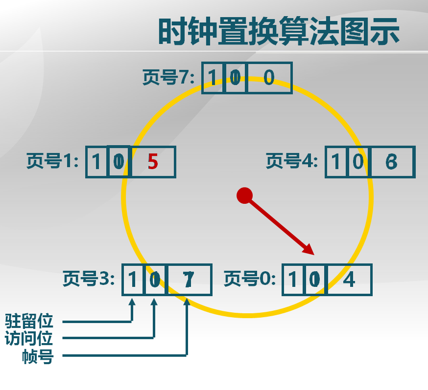

页面置换算法总结
==============

上次说到，当程序要加载不在内存中的页面时，就会产生一个缺页异常。从而操作系统会选择内存中的一个页面，将它换出到外存当中，这样需要加载的页面就可以驻留在刚刚释放出的内存空间了。那么，在内存中的页面那么多，操作系统是如何选择被换出的页面呢？这就是涉及到具体的页面置换算法。

## 页面置换算法的设计思路

前面提到，虚拟存储性能的一个评价指标是有效存储访问时间(EAT, Effective memory Access Time)，页面置换算法的选择将对EAT具有重大的影响。考虑一个比较极端的情况，即每次被换出的页面都是下一次程序要访问的页面，这样每次访存都会产生一次缺页异常，频繁的I/O操作使EAT的值迅速上升，这样的虚拟存储的性能显然是我们不能接受的。

可见，页面置换算法对虚拟存储的性能具有非常重要的意义，好的页面置换算法可以有效地降低缺页率，从而提升虚拟存储整体性能。因此，我们可以提出页面置换算法的设计目标，即

+ 应该尽可能减少页面的调入调出次数。
+ 把未来不再访问或短期不再访问的页面调出。

在设定好了页面置换算法的设计目标后，我们很快就产生了下一个问题，即

> 怎么评价不同的页面置换算法呢？

一个简明的思路是在一个用户进程的运行过程中，对发生的缺页异常数进行统计，通过比较不同置换算法下发生的缺页异常数量，来评估置换算法之间的好坏。

不难看出，这个思路存在很大的缺陷。因为即使是同一个的程序，在先后的两次运行中，其访问的内存页面序列也会是不一样的，从而难以对页面置换算法的性能进行评价。

为了获得相同的内存页面访问序列，我们可以记录进程访问内存的页面轨迹，随后再离线地模拟页面置换的行为，记录产生缺页的次数。从而缺页数更少的页面置换算法对应了更好的性能。

> 所有的页面都可以被换出吗？

需要指出的是，并非所有的页面都可以被换出，这应该是显而易见的，因为你显然不可以把操作系统驻留的页面给换出去。除此以外，一些应用进程也有一些必须常驻内存的逻辑页面，还有某些对响应速度要求很高的代码和数据，这些页面也不可以被换出，这种情况被称为页面锁定(frame locking)。

为了将这种页面与其他可以被换出的页面区别开，可以在页表项中增加一个锁定标志位(lock bit)，来标志这种页面锁定的情况。

现有的页面置换算法可以分为局部的页面置换算法和全局页面置换算法两种。

## 局部页面置换算法

局部页面置换算法是指，被置换的页面仅限于当前进程占用的物理页面内，而不得影响其他的进程。这就有点类似于前面的覆盖技术了，不过这里的页面置换并不需要程序各模块之间的逻辑关系。

### 最优页面置换算法(OPT)

顾名思义，最优页面置换算法是拥有最优性能的算法(optimal)，除了一点，它不能被实现......这就好比我说我的女朋友是世界上最好看身材最好的女生，除了唯一的缺点就是她不存在。

那我们就先来看看<del>我的女朋友她的性能有多优</del>（不是），<del>这个页面置换算法有多好看</del>......算了，差不多就是这个意思。

> 最优页面置换算法的思路

其实它的思路就是每次发生缺页的时候，总是换出未来最长时间不访问的页面。这其实是一种贪心的策略，看起来似乎未必是最优，以后我可能会写个证明。

由于实现这个算法，操作系统需要事先知道未来的一段的时间里，这个程序会访问哪些页面，所以很明显这个算法是不可被实现的！

那么既然如此，它存在的意义又是什么呢？这就好比真理的绝对性与相对性的辩证关系一样，绝对真理是存在的，但是客观世界中的定理只有可能接近这个真理，却不可能完全达到这个真理，即真理的相对性。这里也是一样，最优页面置换算法可以给其他算法提供一个评价指标，来判断某个可以实现的算法离真正的最优还有多少距离。

### 先进先出算法(FIFO)

这个算法的思路也和它的名字一样，即驻留在内存中时间最长的页面被置换。

为了实现这个算法，只需要维护一个队列，来记录所有页面进入内存的先后次序。队列头驻留内存的时间最长，队列尾最短。出现缺页时，选择队列头页面进行置换，将被换入的页置于队列尾。

容易看出，这个算法实现非常简单，并且为了维护这个队列所需要额外的开销也很小。不过它的缺点是性能太差，并且可能会出现`belady`现象。

> 什么是`belady`现象？

一般说来，随着一个进程被分配的物理页数量的增加，其运行时产生的缺页异常数应该减少才对。`belady`现象却是，进程分配物理页面数增加时，缺页出现的次数也增加的情况。

发生`belady`现象的原因，是页面置换算法的置换特征与进程访问内存的动态特征矛盾了，例如前面提到的每次刚被换出的页面，恰好是下一次访存会访问的页面。即被置换出去的页面，并不一定是进程近期不会再访问的。

以后可能会写一个证明，对于栈式的页面置换算法，例如最优页面置换算法，是不会出现`belady`现象的。像是`FIFO`这样的队列式的算法，就比较够呛。

### 最近最久未使用算法(LRU)

这个算法是思路就是选择最长时间没有被引用的页面进行置换。它是基于局部性策略的一种思路，因为`LRU`认为，如果一个页面长时间没有被访问，那么它在将来的很长时间内也很可能不会被访问。可以看到，`LRU`其实是最优置换算法的一种近似啊，所以它的性能也是最接近最优置换算法的。

为了实现`LRU`，需要记录内存中的每个逻辑页面上一次的访问时间。在缺页时，选择上一次使用到当前时间最长的页面。

`LRU`的可能实现方法可以使用一个页面链表，其中的页面按最后一次的访问时间排序，如果访问到了一个驻留在内存中的页面，则找到链表中的该页面，并且将它移动到链表首部。可以看到，`LRU`算法运行的开销很大，一次未发生缺页的访问也需要遍历链表，平均情况下的时间复杂度为`O(n)`。或者使用一个活动页面栈，其实也是类似的思路。

### 时钟置换算法(clock)

时钟置换算法是`FIFO`与`LRU`的折中。通过分析，我们可以发现，`FIFO`的性能之所以很差，是因为它只记录了各个页面进入内存的时间，却没有利用上过去一段时间内对这些页面的访问信息。而`LRU`虽然性能很好，但是算法本身运行的开销却太大，这是因为它完全保存了过去一段时间的页面访问情况。

因此，我们希望设计一种算法，它会利用到过去页面的访问信息，但是不会像`LRU`那样将全部信息都维护起来，这就是我们这里的时钟置换算法的思路。

时钟置换算法会利用到页表项中的访问位，当访问某一页面时，就将该页面的访问位置一。发生缺页时，依次检查驻留在内存中的页面的访问位，如果该位为一，将清零；直到找到一个访问位为零的页面，将该页面置换出去。由于这样一个逐个扫描内存中的页面的行为，类似于时钟指针的运行，所以这个算法才叫时钟置换算法。下图是`clock`算法的图示：

可以看到，这里的访问位，其实就对应了上次缺页到此次缺页，页面的访问情况--访问位为一表示在此期间页面曾被访问，访问位为零则表示没有访问。将访问位为零的页面置换，其实就类似于`LRU`中将最长时间没有被访问的页面置换。相对于`FIFO`，`clock`利用了过去页面的访问信息；相对于`LRU`，又没有保存那么全面的信息，因此算法运行的开销较小。

根据上面的讨论，如果根本就没有过去页面访问的信息，那么`FIFO`, `LRU`, `clock`算法应该是一致的。这种情况对应于，一个页面在第一次进入内存当中后，就再也没有被访问过，此时`LRU`和`clock`算法都将退化为`FIFO`算法。

### 改进的时钟置换算法

上一篇提到，对于发生了修改的页面，在被移出内存时，还需要被写回到硬盘上，因此比一般的页面置换多了一次的访存开销。基于这样的考虑，在选择被换出的页面时，是否可以优先选择没有被修改的页面，从而节省开销。这样的话，被修改的页面在后续也极有可能再次被修改，将多次修改一次写回到外存会节省不少的I/O时间。

将这样修改的思路应用到时钟置换算法上，就是这里的改进的时钟置换算法。具体的思路就是上面那样，总是优先选择未被访问(访问位为零)，且未被修改的页面被置换。

具体的实现可以参考访问位的思路，在页表项中再添加一个修改位，来表示该页面被修改的情况。在发生缺页异常时，同样地依次检查驻留在内存中的页面的页表项，若访问位为一，则将访问位清零；若访问位为零且修改为为一，则将该页面写回到外存，且将修改位清零；直到发现一个访问位和修改位都是零的页面，选择将其置换。改进的时钟置换算法如下图所示：

可以看到，通过增加了修改位，可以使被修改的页面延迟被写回到外存中的时间，从而减少修改页的缺页处理开销。

### 最不常用算法(LFU)

最不常用算法和`clock`算法一样，其实也是`FIFO`和`LRU`的折中。它的思路是在每次缺页时，将访问次数最少的页面换出到外存当中。

它的实现也比较简单，只需要维护一个计数器，来对每个页面被访问的次数进行计数，在缺页时选出计数值最小的页面进行换出就可以了。

这个算法还是具有一些问题的，例如考虑一种情况。我们说内存的访问是有局部性的，考虑某一页面，在进程运行的前一半时间内经常被该进程访问；后来该页面的功能已经完成了，在该进程运行的后半时间里面，对这个页面将不再访问。根据`LFU`算法，此时这个页面的计数值已经足够的大，以至于后续根本不能将该页面进行换出了。

